### 1. Segment Anything

论文链接:https://arxiv.org/abs/2304.02643

代码地址:https://github.com/facebookresearch/segment-anything

应用地址:https://segment-anything.com

这篇文章的目标是建立一个图像分割的即时基础模型，实现在多种数据集上对其进行预训练后解决下游的分割任务。

这项工作的成功取决于任务、模型和数据三个部分，因此有三个关于图像分割的部分需要解决:

    (1) 什么任务适用于 zero-shot generalization?
    (2) 对应的模型结构应该是怎样的?
    (3) 什么样的数据能够驱动这项任务和模型?

本文首先首先定义一个通用的提示的分割任务，可以提供一个强大的预训练目标并支持广泛的下游应用。此任务需要一个支持灵活提示的模型，并且可以在提示时实时输出分段掩码以允许交互使用。此外，一个多样化的、大规模的数据源也是必需的。

首先提及的是 __任务__ 方面，__基础模型(foundation models)__ 可以通过使用 __prompting技术__ 来完成对新数据集和任务的zero-shot和few-shot学习。

__模型__ 方面，作者将提出的模型称为 SAM，并满足三个方面的条件: (1) 图像编码器能给出有效的embedding; (2) embedding对应的prompt; 以及 (3) 将(1)(2)两个信息源在一个轻量级的masked decoder 中进行组合，用于预测分割mask。总体而言，SAM模型具备灵活的提示支持、实时计算mask以及对歧义的感知的能力。

然后作者提到在 __数据__ 方面，其数据集需要适当的数据引擎进行构建。数据引擎包括三个阶段：辅助手动、半自动和全自动。

    (1) 辅助手动: SAM辅助标注员进行标注mask，类似于经典的交互式分割设置。
    (2) 半自动: SAM可以通过提示模型可能的目标位置自动生成一部分对象的mask，标注员则专注于标注剩余的对象，从而增加mask的多样性。
    (3) 全自动: 标注员通过在前景点上使用规则网格来提示SAM，每张图像平均生成约100个高质量的mask。

接下来展开谈谈文章在各个方面的具体实现:

关于任务，其intuition是将自然语言处理（NLP）中的prompt的概念转化到分割领域，其中提示可以是前景/背景点集、粗略的框或mask、自由形式的文本，或者一般情况下的任何指示图像中需要进行分割的信息。

而可提示分割任务的目标是在给定任何提示的情况下返回一个有效的分割mask。所谓有效mask要求是在模棱两可的提示或是可能涉及多个对象的情况下，也应该对其中至少一个对象生成一个合理的mask(参考下图)。且这个任务可以用于预训练，并且这样的预训练的结果可以直接作用于下游任务，因此是zero-shot的，此外还提了一系列相关的分割任务（交互式分割、边缘检测、超像素化、对象提案生成、前景分割、语义分割、实例分割、全景分割等）。

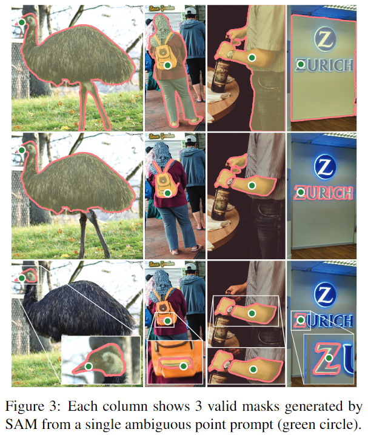

SAM的结构如下图，由三部分组成: an image encoder, a flexible prompt encoder, and a fast mask decoder，且该模型建立在ViT的基础上，接下来分别看看这几个部分做了什么:

(1) image encoder: 使用经过MAE预训练的ViT，采用一些trick用来支持高分辨率图像的输入。

(2) prompt encoder: 考虑两类提示: 稀疏提示（点、框、文本）和密集提示（mask）。对于稀疏提示，使用位置编码来表示点和框，位置编码与每种提示类型的learned embedding相加，而对于自由文本，则使用CLIP的现成文本编码器；对于密集提示（mask），则使用卷积进行embedding，并与图像embedding进行逐元素求和。

(3) mask decoder: 将图像embedding、提示embedding和输出token高效地映射到一个mask。采用了Transformer decoder block 的修改版本，后接动态mask预测头。修改后的decoder block在两个方向上（提示到图像embedding和图像embedding到提示）使用自注意力和交叉注意力来更新所有embedding。在运行两个block之后，我们上采样图像embedding, 使用多层MLP将输出token映射到一个动态线性分类器，计算每个图像位置处的掩码前景概率。

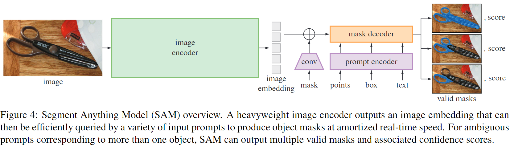

关于歧义的解决，则是对模型进行了修改，使其能够为单个提示预测多个输出mask。观察发现，预测3个mask输出就足以解决大多数常见情况（嵌套mask通常最多三层: 整体、部分和子部分, 原文:whole, part, and subpart）。在训练过程中，仅反向传播掩码的最小损失，通过为每个mask预测置信度得分（即估计的IoU）后进行排名。

其他还有关于效率和Loss的一些叙述，运行时间约50ms, 训练采用的Loss为 focal loss 和 dice loss。

然后是介绍作者他们弄的数据集和数据引擎1.1B mask dataset, SA-1B，这里主要就讲了怎么去通过之前说的三个阶段来做数据的，总的来说是一些怎么去做mask的操作和指标上的细节问题。

而后是结果方面的一些讨论，首先是Zero-Shot迁移实验，作者考虑了五个任务，其中四个与训练SAM的可提示分割任务明显不同。这些实验评估了SAM在训练过程中未见过的数据集和任务上的表现，这些数据集可能包括在SA-1B不存在的图像分布（例如图中所示的underwater or ego-centric图像）。

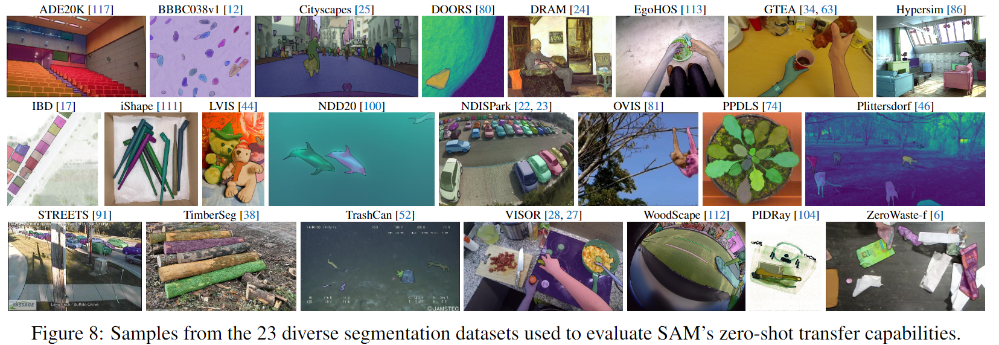

具体而言则是提示SAM执行以下任务: (1) 边缘检测，(2) 分割所有物体即目标提案生成，(3) 分割检测到的物体即实例分割，以及(4) 作为概念验证，从自由文本中分割物体。这四个任务与SAM训练时的可提示分割任务明显不同并通过提示工程实现。

在评估方面，除了使用标准的mIoU指标外，还采用人工方式来进行语义判断，其中注释员根据从1（无意义）到10（像素完美）的评分来评估mask质量。当然具体的评估项目也就是第7节开始的小标题所述了，作者有关于此有详细的图标总结。总的来说，在分割上的性能挺好，在其他例如边缘检测的任务上就不如近来的其他先进模型。

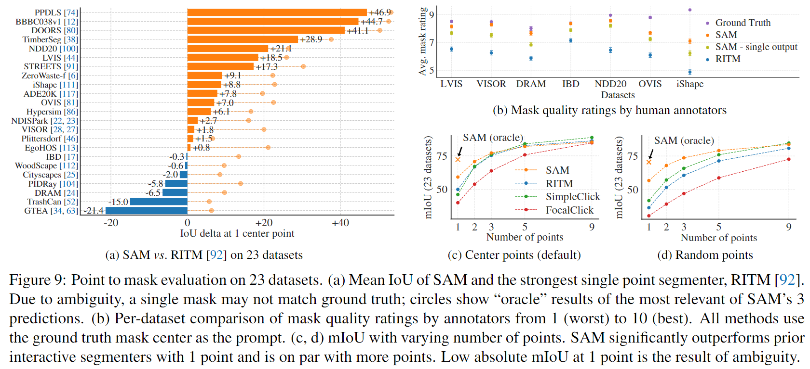

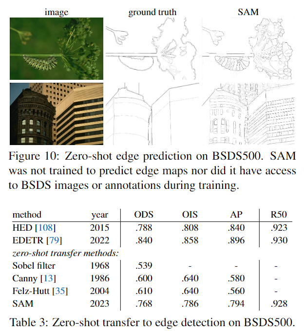

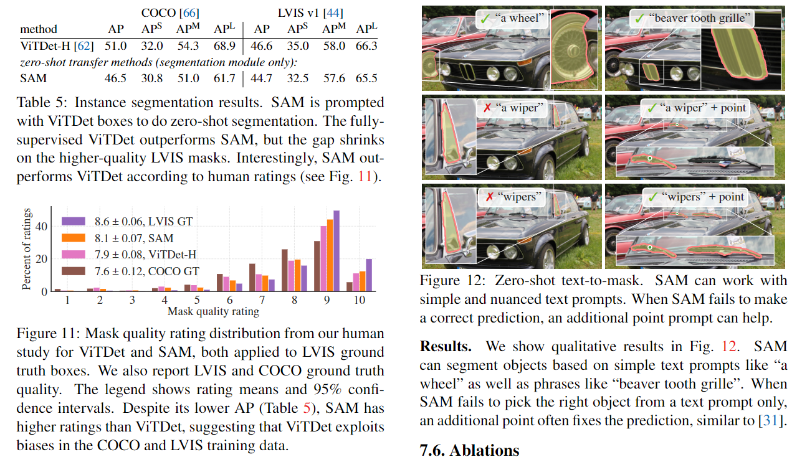

随后是一些消融实验，用以说明所设计工作的意义:
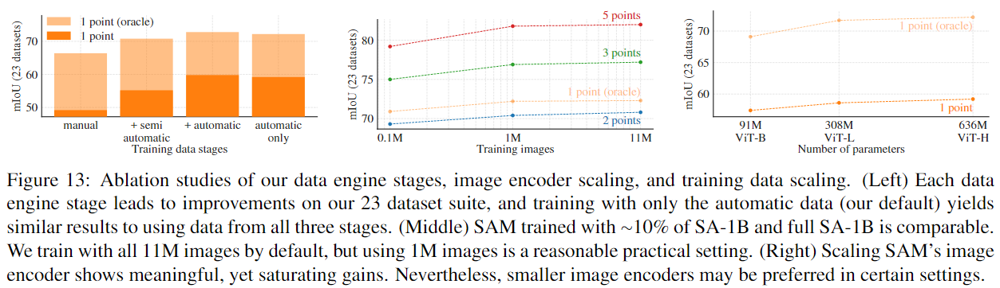

最后总结怎是吹了一波提示分割以及预训练模型在泛化性上的好处，以及一些细节分割上的局限性。

    另：这里提一下 OCTA 在官方 Demo 上的表现。

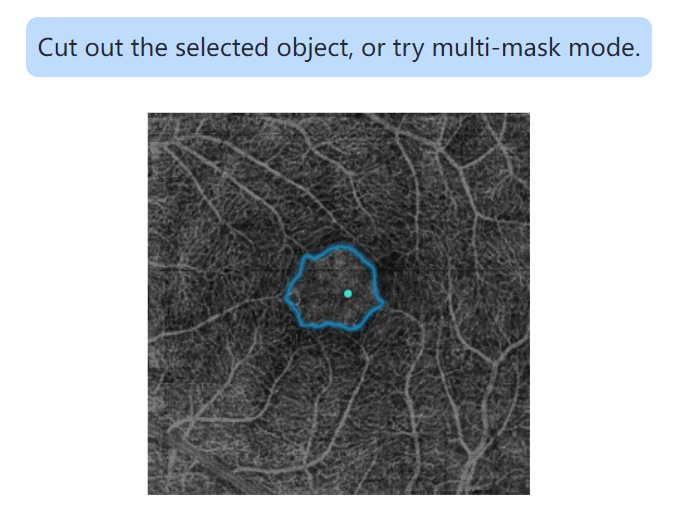

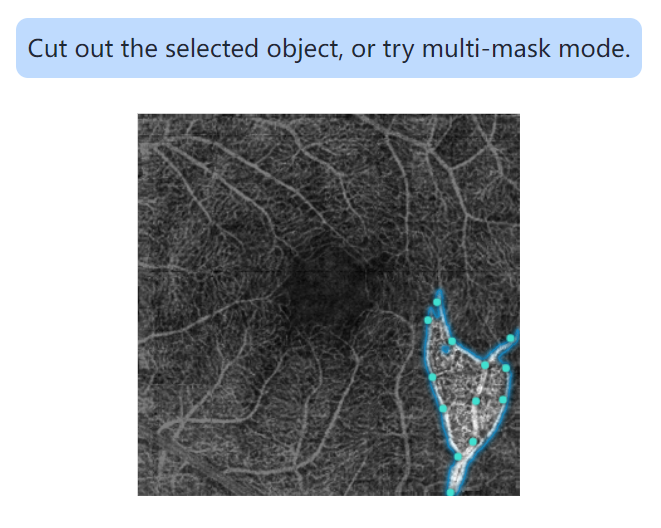

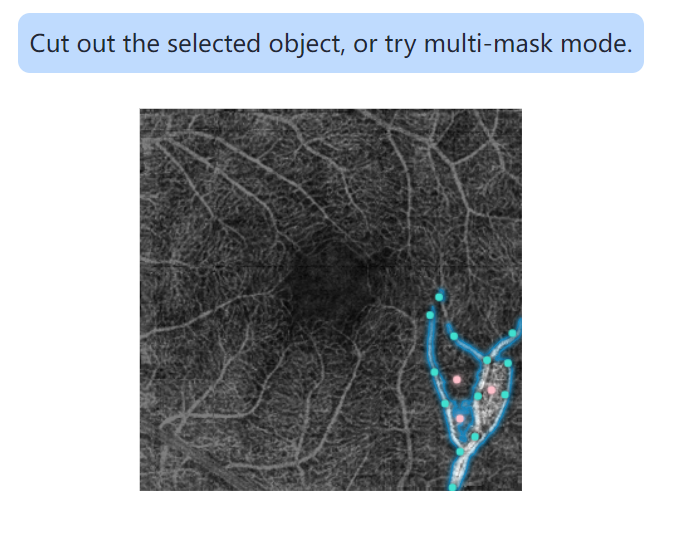

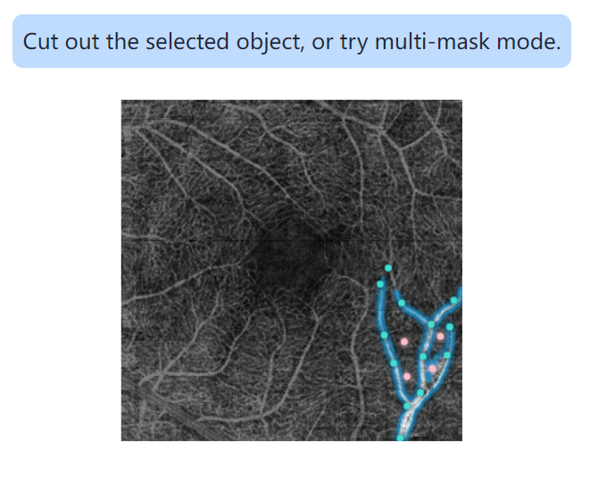

可以看出如同综述和 __论文 2.__ 分析的一样，对于轮廓清晰的大型联通对象的分割效果才比较好（例如FAZ）；对于RV本身无论怎么调整作为提示的正负点，效果也还是不太好，尤其是微小的末端区域。

 

### 2. How Segment Anything Model (SAM) Boost Medical Image Segmentation?

这篇论文主要是探究SAM在医学图像分割领域的表现，其实还是有点偏综述性质的。前两章主要是提到SAM的大热，提到了其中的优势和局限性，以及本文所要在各个模态和种类的医学图像中利用SAM以图像分割为目的的一些分析。和 __论文 1.__ 所提到的一样，对SAM的基本概念进行介绍：

    Segment Anything Model（SAM）在大规模的SA-1B数据集上进行训练，该数据集包含了前所未有的图像和标注数量，使得模型具备了强大的零样本泛化能力。SAM使用基于ViT的图像编码器提取图像特征并计算图像embedding，使用提示编码器embedding提示并整合用户交互。然后，从两个编码器中提取的信息通过轻量级的mask解码器进行组合，基于图像embedding、提示embedding和输出token生成分割结果。

( ~~上面机翻润色的，大致理解一下~~ )

然后是各组件Image Encoder，Prompt Encoder以及Mask Decoder的介绍，由于 __论文 1.__ 已经提过还有图，这里就省略了。还有一点点对于数据引擎的介绍，这是为了快速进行标注工作而构建的，交互式的意思就是先机器自己标，人看到有不对的可以改，最后稳定了全部由人点点点提示机器完成。

第三章开始就是介绍SAM在医学领域的一些表现了，自然是有好有坏。设置条件包括评估了SAM在肿瘤分割、非肿瘤组织分割和细胞核分割等整张切片成像（WSI）上的表现，进行包括使用单个正点提示的SAM、使用20个点提示（其中10个为正点，10个为负点）的SAM，以及在每个单个实例对象上使用所有点/框的不同场景，结果表明SAM在 __大型连通对象(large connected object)__ 的分割性能才比较好。文章对以下任务进行了更为细致的分析：增强对比度计算机断层扫描(CECT)下的肝肿瘤分割；结肠镜图像中的息肉分割；脑MRI分割；腹部CT器官分割以及内窥镜手术器械分割等。最后给了一张Dice指标为标准的直方图来比较不同的场景方法，简而言之就是直接将SAM应用于医学图像分割时，其泛化能力有限，且在不同数据集和任务之间差异显著。

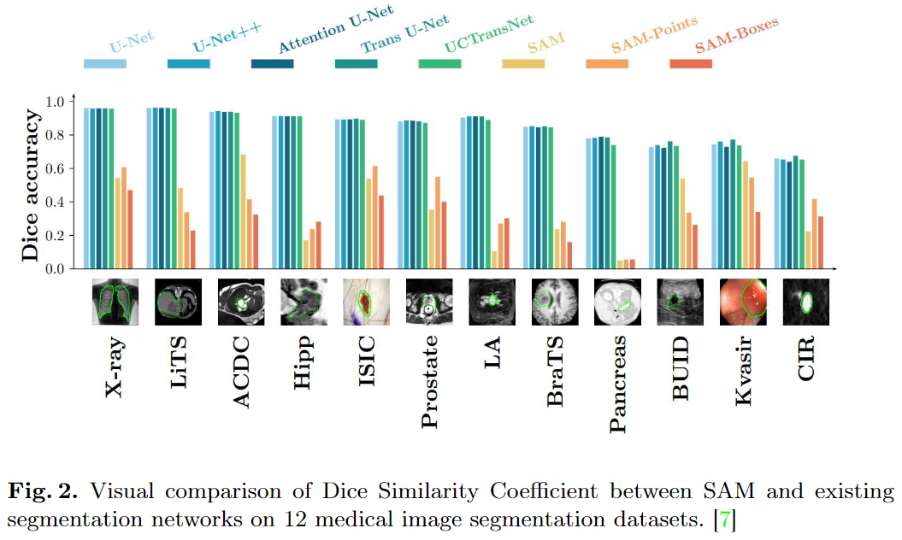

第四章讲SAM针对于医学图像的改进，具体而言是如下几个方面：

    （1）针对医学图像的特有格式（如NII和DICOM）进行相应改进。
    （2）在医学数据集上对SAM的各组件参数进行微调，例如通过在目标数据集上微调SAM，模型在皮肤癌分割任务中的Dice系数从81.25%提高到88.79%。
    （3）利用SAM进行输入增强，使用分割先验图。

总结提到未来的发展可以从以下几个方面着手：将SAM从2D扩展到3D医学图像、降低医学图像分割的标注成本、探索除点和框提示之外的其他提示形式、以及将SAM与眼动跟踪技术相结合，设计协作的人机交互系统，使放射科医生能够通过直接观察感兴趣区域获取分割掩码。

第五章就是纯纯的总结时间了，其实就是把第四章的总结扩展了一下，这里不再重复了。

 

### 3. BreastSAM: A Study of Segment Anything Model for Breast Tumor Detection in Ultrasound Images

论文链接: https://arxiv.org/abs/2305.12447

这篇文章讲了 SAM 在乳腺癌分割的应用，具体而言就是分割乳腺肿瘤。

首先是对乳腺肿瘤的简要介绍：

<small>
乳腺肿瘤，也称为乳房肿块，是指乳房内组织的异常增长。它通常表现为乳房组织的部分肿胀和增厚，以及在乳房或腋窝下形成的肿块。根据其性质，乳腺肿瘤可以广泛分为两类：良性肿瘤和恶性肿瘤（乳腺癌）。良性乳腺肿瘤通常具有明确的边界，在医学成像上呈现出圆形或椭圆形。而恶性肿瘤则呈不规则形状，可能具有小叶(在一些器官存在由许多类似形状和功能的结构单元组成的层级结构，这些结构单元被称为小叶)。
</small>

 

然后是对以往的监督分割模型，例如U-Net的一些说明，主要是认为大量标注方面十分麻烦，随即提到SAM的概念和优势，即通过提示能够在新数据集和任务上进行零或少样本学习。本文的研究做出了以下四个方面的贡献：

1. 对ViT-b、ViT-l和ViT-H这三种预训练模型结构进行了彻底的性能比较。

2. 深入研究了在SAM中， prompt 的重要性，理解了它们在指导分割过程中所起的作用。

3. 详细研究了良性和恶性肿瘤分割之间的性能差异。

4. 批判性地探讨了关键肿瘤特征对分割结果的影响。

随后介绍了所使用的乳腺肿瘤超声数据集，具体信息如下：

<small>
该数据集包括2018年收集的600名女性患者的乳腺超声图像，年龄在25岁至75岁之间。数据集包含780张PNG图像，平均大小为500 x 500像素。这些图像被分为三类：正常、良性和恶性。每个类别中的图像分布如下：133张正常图像，487张良性图像和210张恶性图像。该数据集在巴赫亚医院以DICOM格式收集和存储，并经过预处理后，图像数量减少到780张。这些图像是使用LOGIQ E9超声系统和LOGIQ E9 Agile超声系统获取的，分辨率为1280 x 1024。使用MATLAB为每个图像创建了真值或掩膜图像。下图显示了该数据集的示例图像。在本文的分割任务中仅使用了良性和恶性图像。
</small>

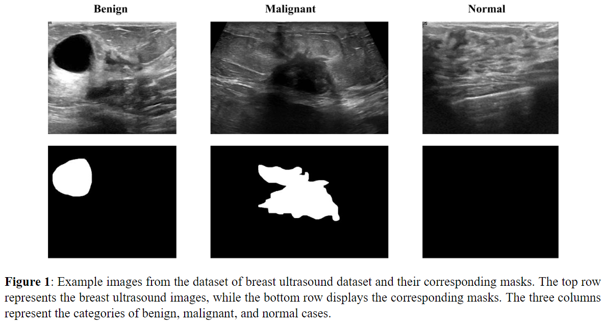

 

随后在方法上，使用了 __草图技术(sketch technique)__ 来指定欲分割的前景区域，具体使用了点和边界框。因为研究中的大多数图像只包含一个乳腺肿瘤，并且这些肿瘤区域通常是连续的，因此每个图像只使用一个提示集(single prompt set)。
然后，SAM的提示编码器会生成一个固定长度的embedding向量，包含提示的语义上下文。将此embedding向量与图像编码器组件的输出合并，形成一系列特征图，由掩膜解码器使用这些特征图生成分割掩膜。选择概率最高的掩膜作为最终的分割掩膜。示例图像的提示、gt mask轮廓和预测mask轮廓如图所示。
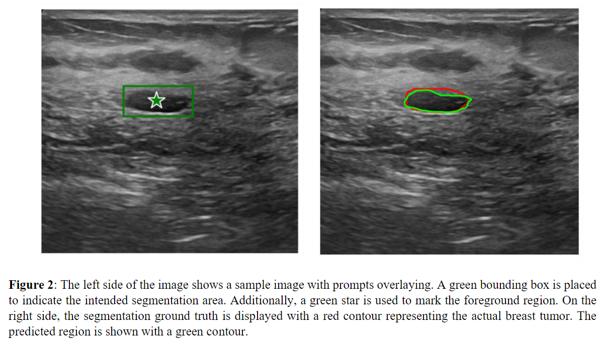

然而在大规模数据集上进行评估时，手绘提示难以实施。为了模拟生成提示的过程，就基于现有的分割掩膜创建"ground prompts"，引入一定程度的随机性。具体而言，遍历数据集中的每个图像及其对应的gt mask，在mask内随机选择一个点，边界框的尺寸由掩膜的尺寸确定，四边各增加20个像素，再随机在水平和垂直方向上最多将边界框位移30个像素，并且随机缩放边界框，允许最多10%的增加。最后，将边界框和点叠加在图像上作为提示。

分割模型的有效性的评估指标采用了像素准确率、交并比(IOU)和Dice分数。

接下来汇报了实验中的一些结果：分析并比较了三种预训练模型变体的性能：ViT_h、ViT_l和ViT_b，指标而言，ViT_l > ViT_h > ViT_b。解释是：尽管ViT_h具有更多的参数，但其性能与ViT_l模型之间的差异主要归因于训练过程中优化的复杂性。更复杂的模型，如ViT_h中的更多参数，通常与更复杂的损失空间相关联。这种复杂性可能使优化算法难以有效地找到全局最小值，可能影响整体性能。

而提示方面的对比，如果没有使用提示，模型缺乏关于用户意图的重要信息，导致难以确定精确的分割区域，此情况下训练时，观察到性能指标显著下降。 ~~（理所当然的结论）~~

模型在分割恶性和良性乳腺肿瘤方面均具备有效性，良性病例中实现的更高像素准确率、Dice分数和IoU分数表明了准确划定良性肿瘤边界的优越能力，而相比之下，恶性乳腺肿瘤的特点是 __更大的异质性、不规则形状和边界__ 。它们的侵袭性和侵入性生长模式对准确分割构成了挑战。恶性肿瘤的复杂性和变异性增加了准确捕捉其全面范围的难度，从而导致稍微较低的分割性能。
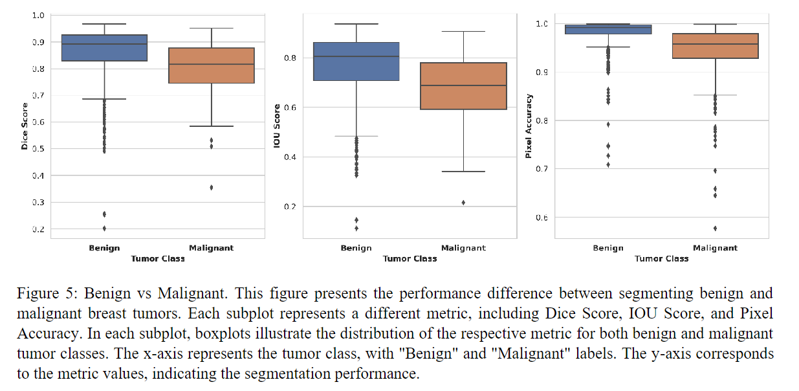

此外还讨论了其他一些方面对于分割性能的影响： __肿瘤大小__ 对于分割性能具有重要影响。较小的肿瘤往往更容易分割，因为它们通常具有更清晰的边界和更规则的形状。相比之下，较大的肿瘤具有更复杂和不规则的形状，更容易受到局部结构的影响，从而导致分割的挑战增加。 __肿瘤形状__ 也对分割性能产生影响。更规则的形状使模型更容易准确捕捉和划定肿瘤的边界。相反，不规则的形状增加了分割的困难，因为边界不清晰且难以确定。 __肿瘤纹理__ 的复杂性和异质性增加了分割的复杂性，因为模型需要能够区分肿瘤区域与周围正常组织之间的差异。

另外还分析了肿瘤大小、对比度、纵横比和复杂性。结果显示，肿瘤对比度与分割性能具有最高相关性，因为对比度更高的肿瘤显示出更明显的视觉差异，使得边界更容易确定。

 

### 4.SkinSAM: Empowering Skin Cancer Segmentation with Segment Anything Model

论文链接: https://arxiv.org/abs/2304.13973

这篇文章是关于皮肤癌区域分割的，首先花一点篇幅介绍皮肤癌的基本情况：

<small>
皮肤癌是皮肤质地、外观或颜色异常变化，威胁着全球数百万人的健康。根据美国癌症协会的数据，皮肤癌是最常见的癌症之一，在美国有超过500万患者。如果恶性皮肤癌不经治疗，它们可以迅速在身体内蔓延，甚至威胁到患者的生命。因此，早期筛查和治疗对于减少患者的痛苦和改善预后至关重要。皮肤癌分割是一项识别和描绘癌症位置和边界的任务。快速准确的皮肤癌分割可以确保疾病监测、诊断、治疗规划和预后的有效性和效率。
</small>

然后是以前的一些方法，R-CNN、U-Net、ViT以及MLP-mixer之类的，但是大量有监督，实际难以实施云云；因此引入SAM以及相关概念。

正片开始，本文使用了名为 __HAM10000__ 的数据集，也是需要cv大法进行介绍的：

<small>
HAM10000数据集收集了10,015张皮肤镜图像，代表了全面的色素性皮肤病变范围。该数据集包含了多种诊断类别，包括光化性角化病和上皮内癌（AKIEC）、基底细胞癌（BCC）、良性角化样病变（BKL）、皮肤纤维瘤（DF）、黑素瘤（MEL）、黑素细胞痣（NV）和血管性病变（VASC）。除了图像外，还提供了每个图像的二进制分割mask，由皮肤科医生创建，用于标识病变区域。这些掩膜最初是使用全连接神经网络（FCN）病变分割模型生成的，然后使用FIJI中的自由手绘选择工具进行手动修正或重新绘制，如图所示。
</small>

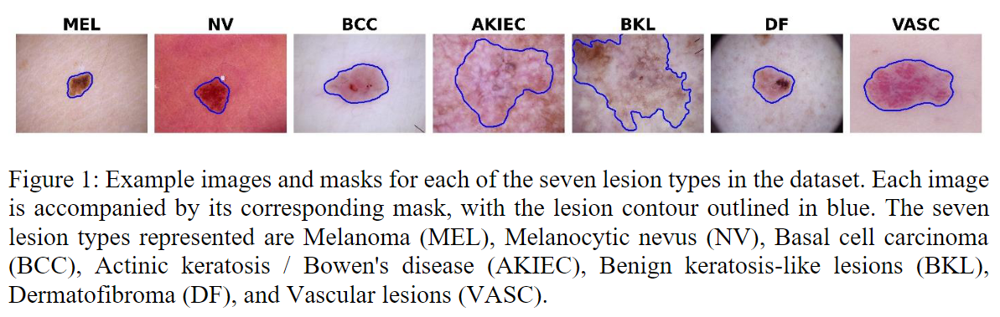

然后是关于 SAM 的使用，可以说和 breastsam 一模一样，其实也很正常，因为这两篇文章都是一个作者写的。这里还是用了 __草图技术(sketch technique)__ 来进行prompt。由于真的可以说是几乎一模一样，所以就省略了这部分内容就省略了，具体可以看 __论文 3.__ 的对应部分。

但是需要补充的一些信息是，作者所选的损失函数为 Dice Loss 和 Cross Entropy Loss，然后作者给出了硬件信息:

<small>
用于微调模型的个人电脑具有x86_64架构，拥有12个CPU，每个插槽6个核心，共计24个线程。CPU型号为Intel Xeon E5-2603 v4 @ 1.70GHz，具有30MB的L3缓存。该系统具有46位物理和48位虚拟地址大小，并通过VT-x支持虚拟化。GPU是一款Tesla V100-PCIE，有2个显卡，每个显卡的内存容量为32GB。
</small>

而对于模型性能的评估指标，依然是像素准确性、交并比(IOU)和Dice分数。

惯例看看汇报的结果，首先有prompt自然更好，然后是不同类型病变的比较，AKIEC和BCC病变类型的平均得分最低。所有病变类型和指标的得分方差相对较低，最高方差为0.02。这表明模型在不同病变类型和指标下表现一致。总体而言模型在准确检测和分割不同病变类型方面表现良好，但在具体的病变类型和指标上可能存在一定的性能差异。详细结果看表：

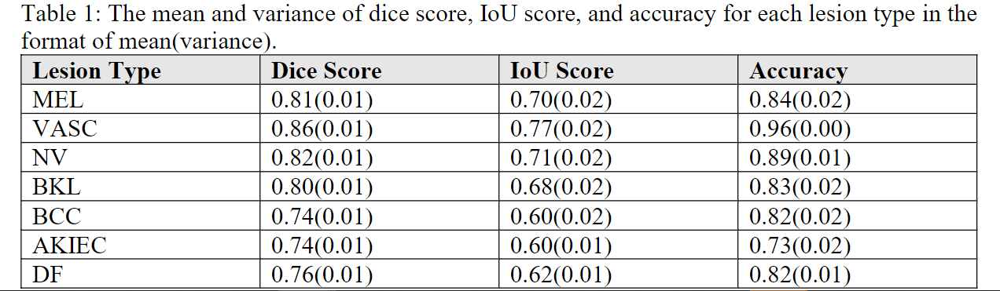

那么模型之间的比较呢？SAM模型使用了三种Vision Transformer（ViT）架构的变体——ViT_b、ViT_l和ViT_h。其中ViT_b的参数量最小（9100w参数），因此有机会微调，总体而言ViT_b_finetuned模型在所有三个指标上的表现优于没有微调的模型。

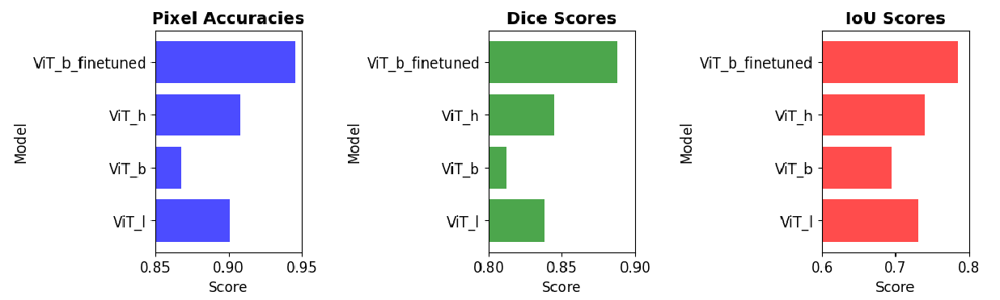

最后论文给出的结论可以总结为：需要prompt,需要fine-tuning。