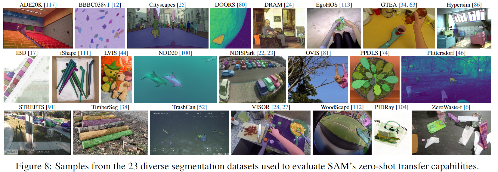
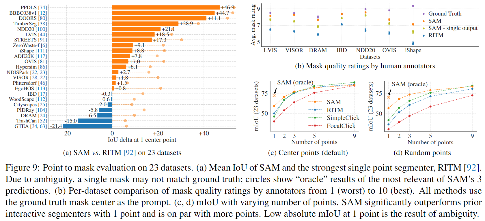
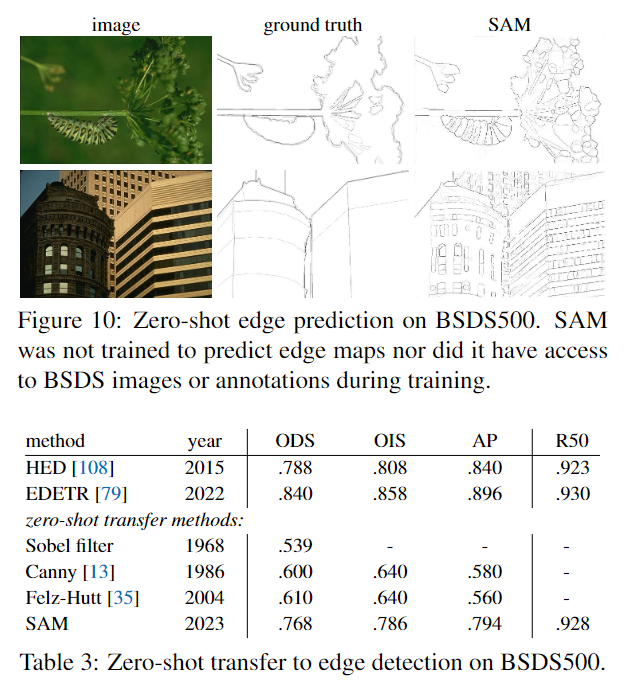
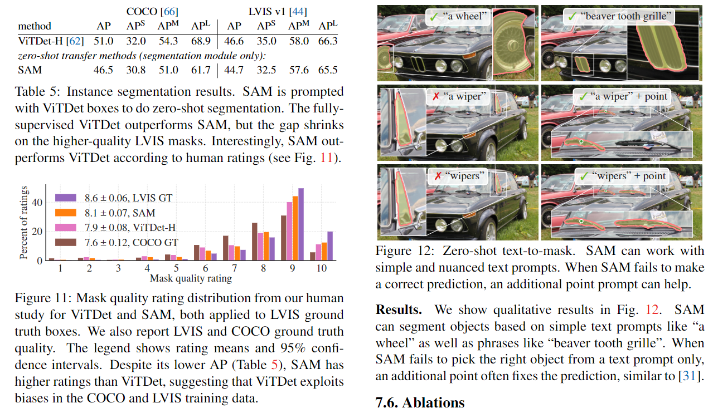

### 1. Segment Anything

论文链接:https://arxiv.org/abs/2304.02643

应用地址:https://segment-anything.com

这篇文章的目标是建立一个图像分割的即时基础模型，实现在多种数据集上对其进行预训练后解决下游的分割任务。

这项工作的成功取决于任务、模型和数据三个部分，因此有三个关于图像分割的部分需要解决:

    (1) 什么任务适用于 zero-shot generalization?
    (2) 对应的模型结构应该是怎样的?
    (3) 什么样的数据能够驱动这项任务和模型?

本文首先首先定义一个通用的提示的分割任务，可以提供一个强大的预训练目标并支持广泛的下游应用。此任务需要一个支持灵活提示的模型，并且可以在提示时实时输出分段掩码以允许交互使用。此外，一个多样化的、大规模的数据源也是必需的。

首先提及的是 __任务__ 方面，基础模型(foundation models)是一种有前途的发展，可以通过使用 __prompting__ 技术来完成对新数据集和任务的zero-shot和few-shot学习。

__模型__ 方面，作者将提出的模型称为 SAM，并满足三个方面的条件: (1) 图像编码器的有效embedding; (2) embedding的prompt; 以及 (3) 将(1)(2)两个信息源在一个轻量级的masked decoder 中进行组合，用于预测分割mask。总体而言，SAM模型具备灵活的提示支持、实时计算掩模以及对歧义的感知的能力。

然后作者提到在 __数据__ 方面，其数据集需要适当的数据引擎进行构建。数据引擎包括三个阶段：辅助手动、半自动和全自动。

    (1) 辅助手动: SAM辅助标注员进行标注掩模，类似于经典的交互式分割设置。
    (2) 半自动: SAM可以通过提示模型可能的目标位置自动生成一部分对象的掩模，标注员则专注于标注剩余的对象，从而增加掩模的多样性。
    (3) 全自动: 标注员通过在前景点上使用规则网格来提示SAM，每张图像平均生成约100个高质量的掩模。

接下来展开谈谈文章在各个方面的具体实现:

关于任务，其intuition是将自然语言处理（NLP）中的prompt的概念转化到分割领域，其中提示可以是前景/背景点集、粗略的框或mask、自由形式的文本，或者一般情况下的任何指示图像中需要进行分割的信息。

而可提示分割任务的目标是在给定任何提示的情况下返回一个有效的分割mask。所谓有效mask要求是在模棱两可的提示或是可能涉及多个对象的情况下，也应该对其中至少一个对象生成一个合理的mask(参考下图)。且这个任务可以用于预训练，并且这样的预训练的结果可以直接作用于下游任务，因此是zero-shot的，此外还提了一系列相关的分割任务（交互式分割、边缘检测、超像素化、对象提案生成、前景分割、语义分割、实例分割、全景分割等）。

SAM的结构如下图，由三部分组成: an image encoder, a flexible prompt encoder, and a fast mask decoder，且该模型建立在Transformer视觉模型的基础上，接下来分别看看这几个部分做了什么:

(1) image encoder: 使用经过MAE预训练的ViT，采用一些trick用来支持高分辨率图像的输入。

(2) prompt encoder: 考虑两类提示: 稀疏提示（点、框、文本）和密集提示（mask）。对于稀疏提示，使用位置编码来表示点和框，位置编码与每种提示类型的learned embedding相加，而对于自由文本，则使用CLIP的现成文本编码器；对于密集提示（mask），则使用卷积进行embedding，并与图像embedding进行逐元素求和。

(3) Mask decoder: 将图像embedding、提示embedding和输出token高效地映射到一个mask。采用了Transformer decoder block 的修改版本，后接动态mask预测头。修改后的decoder block在两个方向上（提示到图像embedding和图像embedding到提示）使用自注意力和交叉注意力来更新所有embedding。在运行两个block之后，我们上采样图像embedding, 使用多层MLP将输出token映射到一个动态线性分类器，计算每个图像位置处的掩码前景概率。

关于歧义的解决，则是对模型进行了修改，使其能够为单个提示预测多个输出mask。观察发现，预测3个mask输出就足以解决大多数常见情况（嵌套mask通常最多三层: 整体、部分和子部分 ~~原文:whole, part, and subpart,咋定义的？~~ ）。在训练过程中，仅反向传播掩码的最小损失，通过为每个mask预测置信度得分（即估计的IoU）后进行排名。

其他还有关于效率和Loss的一些叙述，运行时间约50ms, 训练采用的Loss为 focal loss 和 dice loss。

然后是介绍作者他们弄的数据集和数据引擎1.1B mask dataset, SA-1B，这里主要就讲了怎么去通过之前说的三个阶段来做数据的，总的来说是一些怎么去做mask的操作和指标上的细节问题。

而后是结果方面的一些讨论，首先是Zero-Shot迁移实验，作者考虑了五个任务，其中四个与训练SAM的可提示分割任务明显不同。这些实验评估了SAM在训练过程中未见过的数据集和任务上的表现，这些数据集可能包括在SA-1B不存在的图像分布（例如图中所示的underwater or ego-centric图像）。

具体而言则是提示SAM执行以下任务: (1) 边缘检测，(2) 分割所有物体即目标提案生成，(3) 分割检测到的物体即实例分割，以及(4) 作为概念验证，从自由文本中分割物体。这四个任务与SAM训练时的可提示分割任务明显不同并通过提示工程实现。

在评估方面，除了使用标准的mIoU指标外，还采用人工方式来进行语义判断，其中注释员根据从1（无意义）到10（像素完美）的评分来评估mask质量。当然具体的评估项目也就是第7节开始的小标题所述了，作者有关于此有详细的图标总结。总的来说，在分割上的性能挺好，在其他例如边缘检测的任务上就不如近来的模型。

随后是一些消融实验，用以说明所设计工作的意义:

最后总结怎是吹了一波提示分割以及预训练模型在泛化性上的好处，以及一些细节分割上的局限性。