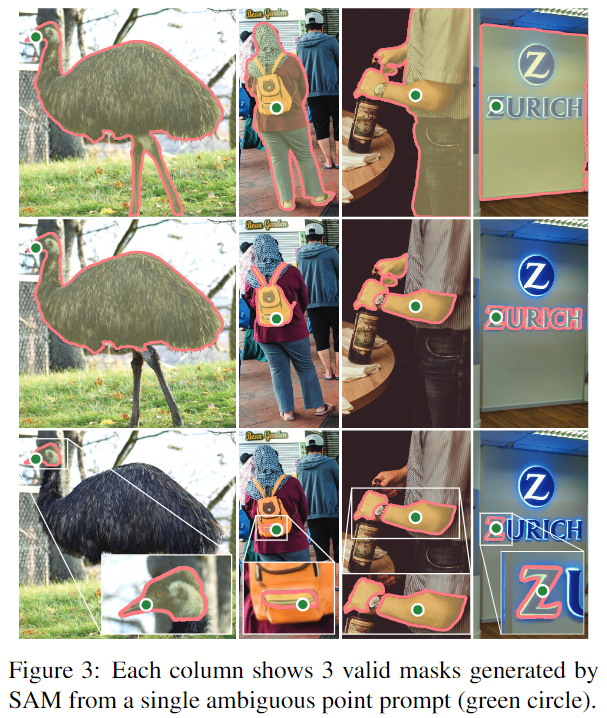

### 1. Segment Anything

论文链接:https://arxiv.org/abs/2304.02643

应用地址:https://segment-anything.com

这篇文章的目标是建立一个图像分割的即时基础模型，实现在多种数据集上对其进行预训练后解决下游的分割任务。

这项工作的成功取决于任务、模型和数据三个部分，因此有三个关于图像分割的部分需要解决:

    (1) 什么任务适用于 zero-shot generalization?
    (2) 对应的模型结构应该是怎样的?
    (3) 什么样的数据能够驱动这项任务和模型?

本文首先首先定义一个通用的提示的分割任务，可以提供一个强大的预训练目标并支持广泛的下游应用。此任务需要一个支持灵活提示的模型，并且可以在提示时实时输出分段掩码以允许交互使用。此外，一个多样化的、大规模的数据源也是必需的。

首先提及的是 __任务__ 方面，基础模型(foundation models)是一种有前途的发展，可以通过使用 __prompting__ 技术来完成对新数据集和任务的zero-shot和few-shot学习。

__模型__ 方面，作者将提出的模型称为 SAM，并满足三个方面的条件: (1) 图像编码器的有效embedding; (2) embedding的prompt; 以及 (3) 将(1)(2)两个信息源在一个轻量级的masked decoder 中进行组合，用于预测分割mask。总体而言，SAM模型具备灵活的提示支持、实时计算掩模以及对歧义的感知的能力。

然后作者提到在 __数据__ 方面，其数据集需要适当的数据引擎进行构建。数据引擎包括三个阶段：辅助手动、半自动和全自动。

    (1) 辅助手动: SAM辅助标注员进行标注掩模，类似于经典的交互式分割设置。
    (2) 半自动: SAM可以通过提示模型可能的目标位置自动生成一部分对象的掩模，标注员则专注于标注剩余的对象，从而增加掩模的多样性。
    (3) 全自动: 标注员通过在前景点上使用规则网格来提示SAM，每张图像平均生成约100个高质量的掩模。

接下来展开谈谈文章在各个方面的具体实现:

关于任务，其intuition是将自然语言处理（NLP）中的prompt的概念转化到分割领域，其中提示可以是前景/背景点集、粗略的框或mask、自由形式的文本，或者一般情况下的任何指示图像中需要进行分割的信息。

而可提示分割任务的目标是在给定任何提示的情况下返回一个有效的分割掩模。所谓"有效"的掩模要求是，即使提示是模棱两可的，并且可能涉及多个对象(参考下图)。
