### 1. Bootstrap your own latent: A new approach to self-supervised Learning

论文地址:https://arxiv.org/abs/2006.07733

代码:https://github.com/deepmind/deepmind-research/tree/master/byol

这篇论文的观察是说现在的网络越来越大，越来越深，那就需要更多的数据来进行训练，而且还可能有梯度消失，梯度爆炸的情况。~呃，那能不能不做这么多题就得到较好的结果呢？~ 现在版本是利用自监督学习或无监督的方法利用更少的数据学到更好的特征表示。

这篇文章的模型结构如图所示，会同时维持两个相同的网络，分为online和target，训练的过程中使online网络不断逼近target网络，target网络也使用 momentum 方式缓慢地更新自己的参数向 online靠拢。~左脚踩右脚~ 具体的流程是，对于同一幅图像，采用两种不同的随机增强策略，分别送入online和target网络，得到两个不同的表示，再通过projection得到新的投影特征（更高维）。对于online网络，会多接一个 $q_{\theta}$ 网络对target分支进行靠拢；而对于target分支，有一个sg(stop gradient)的标志，停止梯度的传播。图中的Loss(MSE)只是作用于online分支的训练，target分支以动量的方式缓慢向online分支靠拢，但两个分支的参数不会达到相同。

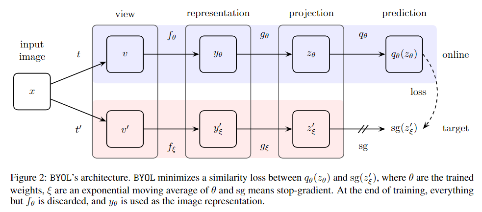

从下面的图中可以看到Loss的更新过程，其中 $L^{BYOL}$ 需要将两个分支的view输入交换得到。

最终得到的是 $f_{\theta}$ 编码器。本质而言，因为有不同策略的图像增强方法，然后通过差异化比较提取出更有效的特征，和对比学习异曲同工。最后作者对比了和Supervised方法和SimCLR方法在ImageNet上的结果，以及一系列消融实验，这里和对比学习的区别在于，由于没有使用负样本，所以对batch size的大小并不敏感（~实际上还是不可避免地敏感~），算是优势之一。

### 2. Exploring Simple Siamese Representation Learning

论文地址:https://arxiv.org/abs/2011.10566

非官方实现:https://github.com/PatrickHua/SimSiam

Siamese 网络比起 BYOL 没有使用动量方法，并且网络结构相对简单，也是一开始分成了两个支，并且使用了相同的权重，但是输入是两个不同的向量，是由同一个输入图像x增强产生的两个不同的图像后输入两个编码器中。其中一个分支进行projection后计算两个分支输出的MSE Loss。

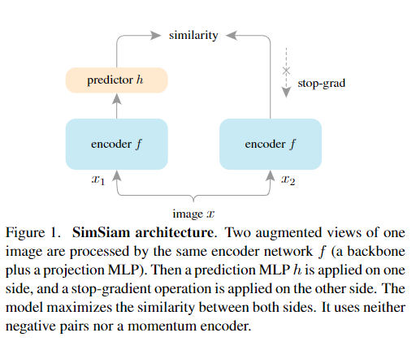

所以为什么如此简单的结构依然能够work呢？分别从以下几个方面进行了测试：1)是否有stop-grad; 2)用不同的predictor; 3)batch-size 和 batch-norm; 4) Similarity Function。
作者猜想的原因是SimSiam是一种最大期望(Expectation-Maximization, EM)算法的实现(~其实我并没有看懂哈哈~)。
然后是进行了相关的消融实验，基于ResNet-50 pre-trained encoder做的，性能表现比起以往工作没有明显下降甚至提升。

### 3. Evolving Losses for Unsupervised Video Representation Learning

论文地址:https://arxiv.org/abs/2002.12177

这篇论文把 unsupervised representation learning 定义成了一个 multi-modal, multi-task learning ，希望结合不同的无监督方法来综合学到一个好的video表示(简介部分)。
multi modality是指提取出各种不同的数据模态（彩色图像、灰度图像、声音以及光流等），multi task是指使用了多种SSL手段，然鹅把各种模态和任务集成到一起(~格调好高，big胆~)，对于损失函数的构建将是一场灾难，要包括的超参数的数量太多了。所以这篇论文的贡献就是怎么去找一个好的损失函数了。

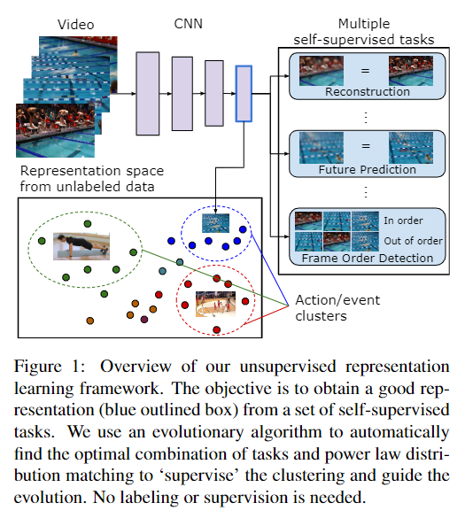

看下图就是不同模态和任务的组合，这个过程中就是把光流和声音网络蒸馏到RGB网络中，只用RGB图像就可以解出一个包含光流和声音信息的representation，以更好的支持后续的下游任务。
关于SS任务，本文搞了以下几个：
1) Reconstruction and prediction: Reconstruct input frame; predict the next N frames given T frames; Cross-modality transfer tasks.
2) Temporal ordering: 判断正反向播放和是否乱序播放（CE loss）（~描述太长概括了~）
3) Multi-modal contrastive loss: 在视频同一个时刻的不同模态所得到的latent representation应该尽量接近，而对于同一个视频不同时刻或是不同视频的模态得到的隐表示应该相互远离。
4) Multi-modal alignment: 不同模态做正负样本，判断是否对齐。

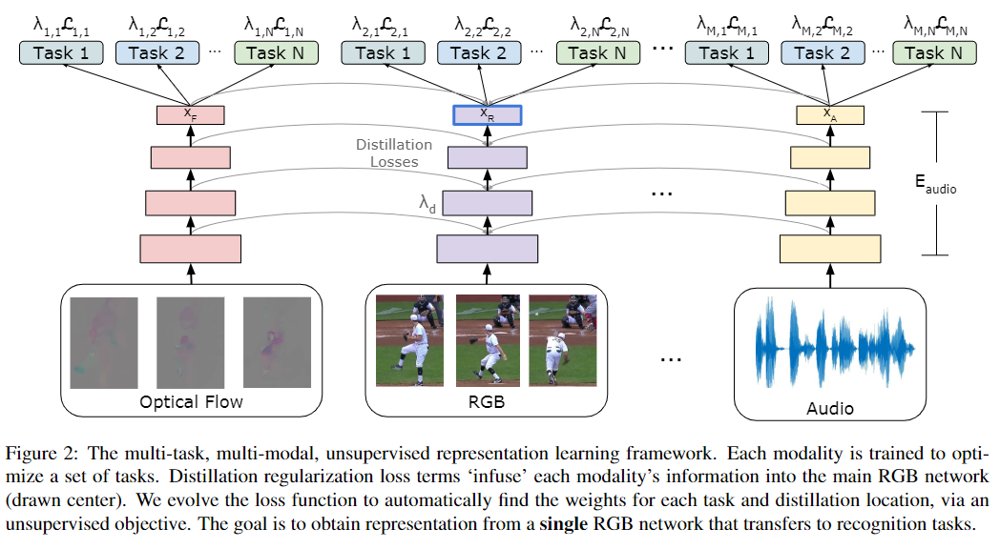

总之就这样搞了一个大的损失函数，那么怎么评价呢？作者发现dataset中样本的数量和标签满足 Zipf 分布（一个标签所对应样本的数量和这个样本的值呈反比关系，类似二八定律）。所以评价方法是对隐表示进行聚类后，对每个类别的样本数量的也应该接近Zipf分布（KL散度判断）。
优化损失函数参数的方法则是搞了一些最优化的搜索方法，像是随机搜索，Grid搜索，最后发现最好的方法是CMA-ES(~没听说过，不懂~)。

最后在不同数据集上进行评测，做了一系列消融实验，对比了有监督学习的方法的表现，效果自然挺好。

### 4. Barlow Twins: Self-Supervised Learning via Redundancy Reduction

论文地址:https://arxiv.org/abs/2103.03230

论文代码:https://github.com/facebookresearch/barlowtwins

这篇文章也是研究一种SSL学到一种更好的表示，同之前的方法相比，本文也是使用了两分支网络，但是梯度的传递和损失函数的构建是与前文不同的。从结构上看，同样是将图像进行不同形式的增强后，输入到两个参数一致网络当中，得到隐向量 $Z^A$ 和 $Z^B$ 。然后计算 $Z^A$ 和 $Z^B$ 对应位置元素的相关性，其相关矩阵尽量接近对角阵。

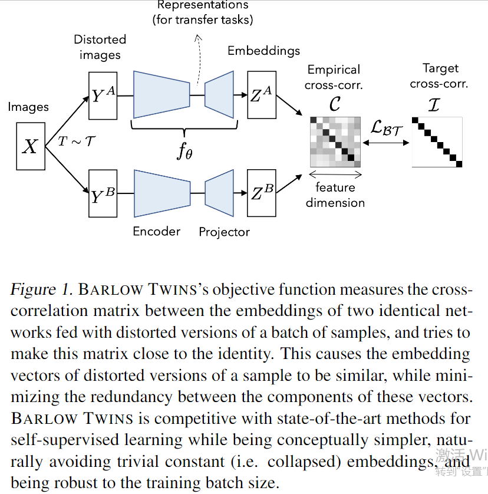

从结果来看，也是对比了之前的方法，然后是在ImageNet上的相关任务的表现，图像分类和迁移学习啥的。（~小技巧：如果你的实验结果表现一般，可以把Top 3都用下划线标出来，这样读者就难以一眼丁真，发现你的方法没有别人的好捏~）而从消融实验来看，本文方法的结果对隐向量 $Z$ 的长度敏感。

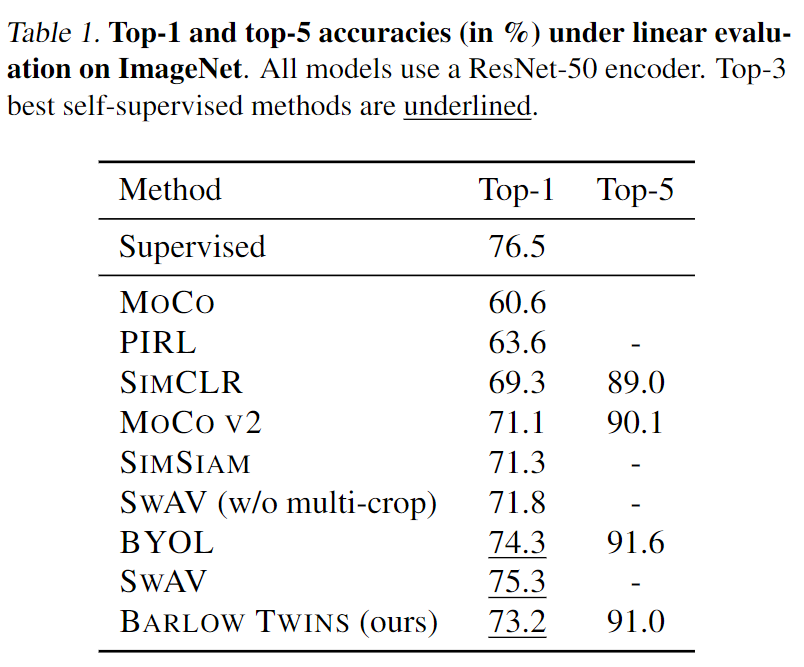

### 5. Unsupervised Learning of Visual Features by Contrasting Cluster Assignments

论文地址:http://arxiv.org/abs/2006.09882

代码:https://github.com/facebookresearch/swav

这篇论文的主要贡献是提出了一种在线算法，用来做SSL，不需要在完整的大数据集上做训练，可以不断加入新的数据改善效果。此外，本文还提出了一种新的图像增强策略叫做 multi-crop，截取图像中的一小块作为增强的样本，在节省内存的情况提高样本多样性。对比学习需要进行特征对比从而带来两个问题：1) 需要做大量样本进行相互对比，所以batch size需要大，才能够更好地把不同样本区别开；2) 随着样本数量的增加，计算量也呈指数倍地增加。那么可以用聚类的方法来达到提升效率和效果的目的，本文提出了Swap的方法，交换从feature到聚类和从聚类到feature的投影方向，才能避免所有的模型都collapse到聚类空间的某一个点上。

从结构上可以看出，与之前的对比学习方法相比，本文引入了一个Prototypes，是一系列聚类中心的集合。这里 $Q$ 是通过 Prototypes 和 $Z$ 共同计算（相乘）得出，相比于 $Z$ 的维度是比较低的，因此可以减少运算量（类似降维）。

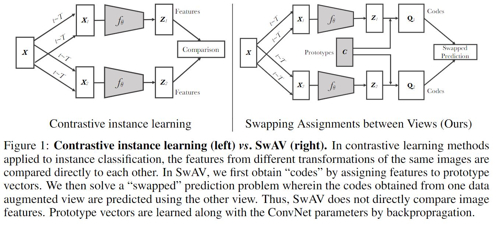

所用到的损失为 Cross-entropy, 写出来就是下面的形式（~看不懂啊，咋想到的~）:

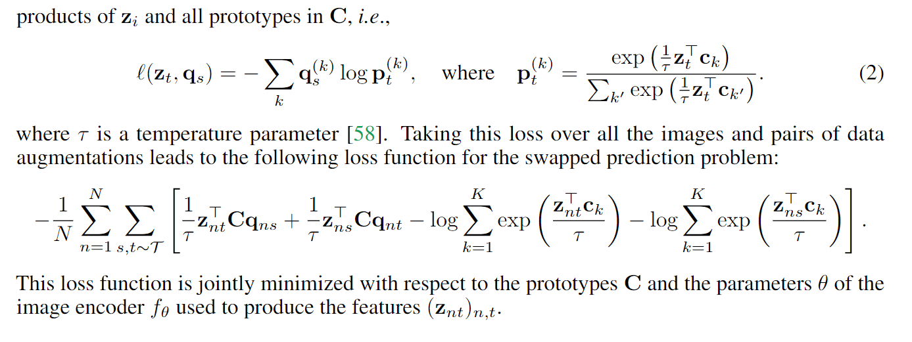

$Q$ 的实现被定义为一个最优化传输(Optimal Transportation)的问题，通过优化 $max Tr(Q^TC^TZ) + /epsilonH(Q)$ 反解出对应的 $Q$ 。
（最优传输问题关注在最小成本下将质量（或资源、物品等）从一个地方（或分布）转移到另一个地方（或分布），试图找到在满足某些约束条件下，传输成本最小的策略。）

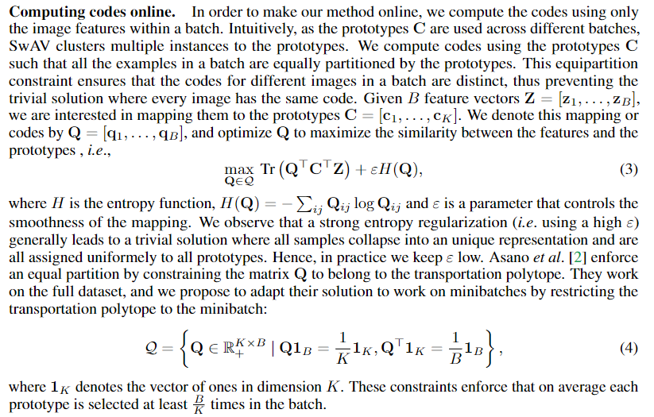

最后汇报了一些ImageNet上的结果，和对有监督和迁移学习方法的对比，也进行了相应的消融实验，例如聚类方法和训练轮次。

### 6. Rethinking Pre-training and Self-training

地址:http://arxiv.org/abs/2006.06882

模型:https://github.com/tensorflow/tpu/tree/master/models/official/detection/projects/self_training

这篇论文主要研究了在更强的数据增强的情况下，pre-training 和 self-training 分别的表现。简而言之，通过实验发现，进行了更强的数据增强策略之后，pre-training的优势下降，甚至导致模型性能下降；而 self-training 在这种情况下的表现挺好。

pre-training的Baseline是 EfficientNet-B7，数据集是ImageNet，然后作者将图像增强的策略由弱到强分为了4个等级：
S1: Filps and Crops; S2: AutoAugment, Filps and Crops; S3: Large Scale Jittering, AutoAugment, Filps and Crops; S4: RandAugment, Large Scale Jittering（更大尺度的缩放）, AutoAugment, Filps and Crops

Self-training的方法是由一个teacher model 产生伪标注，student model同时学习人工标注和伪标注，为了稳定文章对损失函数做了平滑，感觉可以有所借鉴。

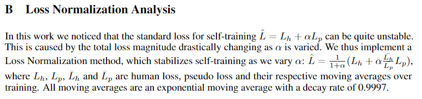

从结果来看，随着图像增强的强度增加，指标上还是提升的，但是预训练的作用会逐渐变得失效，然后使用self-training就好很多，解释是student model能够意识到teacher model给的伪标签和人工标签的区别（~啊？~）。总之文中通过一系列消融实验证明说，self-training的方法可以帮助避免人工标记的一些错误，总之是将效果提升了。

### 7. Big Self-Supervised Models are Strong Semi-Supervised Learners(SimCLR v2)

论文地址:http://arxiv.org/abs/2006.10029

代码:https://github.com/google-research/simclr

这篇文章就是SimCLR的version 2，换句话说就是换了更大的模型，取得了更好的效果，除此之外还加上了知识蒸馏的部分。 在无监督的环境下，训练好了一个大的模型之后用有监督的方法进行fine-tune得到一个强的分类器，然后再用知识蒸馏的方式将大网络的知识和性能转到小的网络当中。

### 8. Leveraging background augmentations to encourage semantic focus in self-supervised contrastive learning

论文地址:http://arxiv.org/abs/2103.12719

这篇论文通过一种背景增强的手段，能让SS方法更好地关注到图像的语义本身，而非背景的噪声。（另一种图像增强的方式）。首先弄一个分割网络，把前景和背景分开，然后采用了如下三种方法进行背景替换增强，分别是灰色填充，随机替换以及背景交换（把正样本的背景设置为不一样的，把负样本的背景设置为相同）。

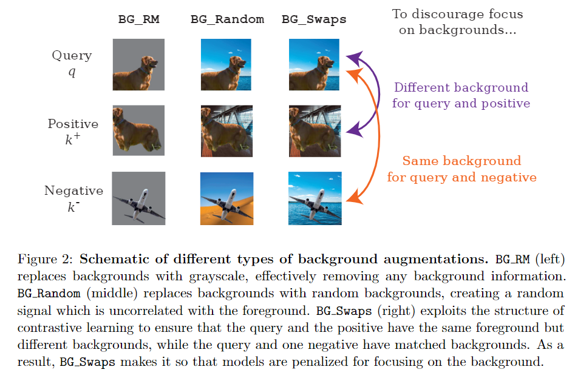

作者进行了不同对比学习方法例如MoCov2, BYOL以及SwAV进行实验，发现效果有所提升；并且对于一些对抗攻击也有所鲁棒性。而前景即使分割得不那么好，对于SSL也有一定效果。

### 9.An Empirical Study of Training Self-Supervised Visual Transformers

论文地址: http://arxiv.org/abs/2104.02057

V1: https://arxiv.org/abs/1911.05722

直接Moco V3 吧，首先还是简要把Moco的由来交代一下，总结有以下几种方法，(a) end-to-end, 同一张图像进行不同方式的增强，放入两个Encoder里面，然后算相似程度，对两边的梯度都做传递；(b) memory bank, 锁住一边的key不做梯度传递，每次新图像过 Encoder后从memory bank里面sample出一些representations后和query做比较； (c) key 这边维护了一个队列，比起SimCLR在一个batch内做对比损失，这种方法用很少的代价获得了更多的负样本，在更新了query的Encoder之后，以动量的方式更新key的Encoder参数( $k_{\theta}<-mk_{\theta}+(1-m)q_{\theta}$ )。损失函数还是InfoNCE. 在Moco V1的实验中，作者还讨论了momentum的设置和使用shuffling BN的情况（多GPU交换key和query）。

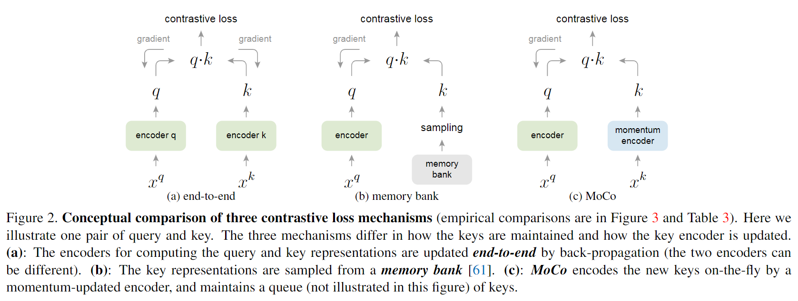

Moco V2 对于 V1 有三个方面的改进，1)对两个Encoder加上了一层MLP head；2)在图像增强中加入了 Blur 方法（模糊）；3）learning rate schedule进行了调整，使用了Cosine方式。加了以上三点后，效果更好。

接着说Moco v3, 之前的两个版本是用ResNet做backbone的，现在把ResNet换成ViT后看看效果怎样。这个版本又把Memory queue给去掉了，因为作者说又可以训练很大的batch size了，然后加了一个projector(SimCLR)。

在模型训练过程中会出现不稳定的状况，性能突然下降后再回升，好像突然抖了一个坑。原因是梯度在某些情况下会陡升，并且从浅层传递到深层。解决这样问题的方法是在patch projection后把梯度停掉（~神奇。。~），并且同样也适用于SimCLR, BYOL, SwAV等方法。

而从论文给出的结果上看，以上对比学习方法总的来说在ViT上表现更好，比起ResNet至少是差不多的。

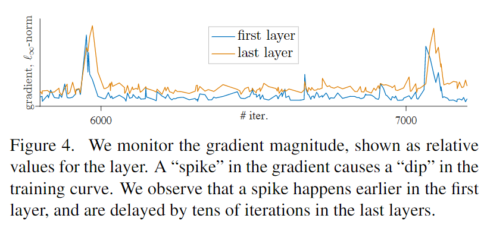
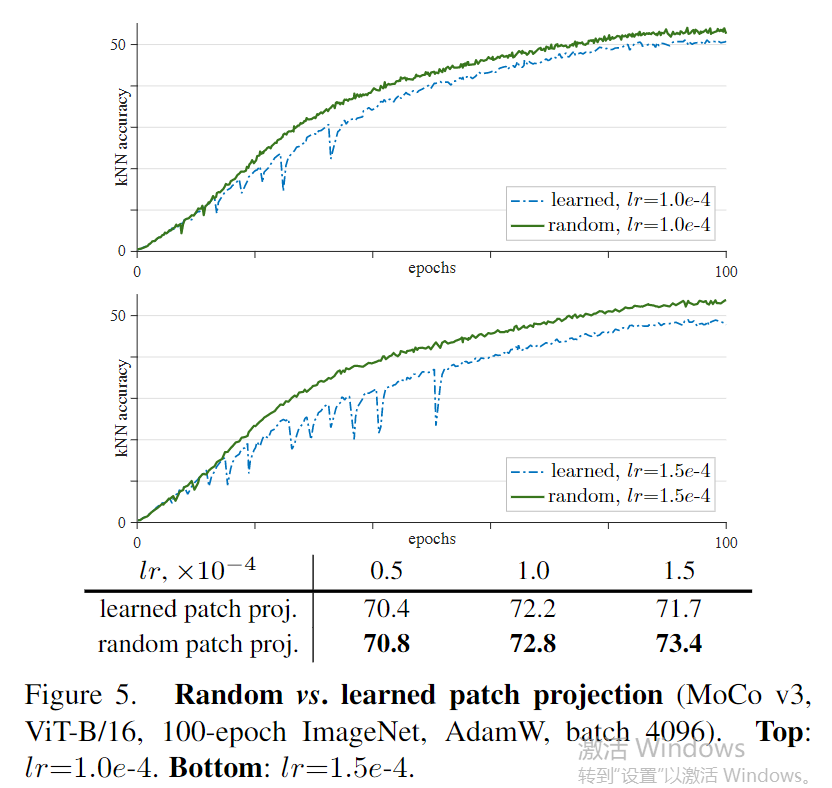
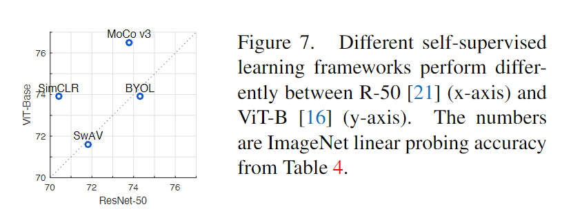

### 10.Auto-encoding Variational Bayes

论文地址: https://arxiv.org/abs/1312.6114

(High dimensional) variable: x - generated from conditional distribution $p_{\theta}^* (x|z)$ .

Unobserved continuous random variable: z - generated from prior distribution $p_{\theta}^* (z)$ .

从贝叶斯公式的角度看，后验概率的计算依赖于 $p_{\theta}(z|x)=\frac{p_{\theta}(x|z)p_{\theta}(z)}{p_{\theta}(x)}$ , 然后先验概率和后验概率都是未知的，所以用神经网络近似:  $p_{\theta}(z|x) \approx q_{\phi}(z|x)$

衡量两个分布的近似程度使用 KL 散度，通过以下变换转化为提升 $L({\theta}, {\phi}; x)$ 的值。 

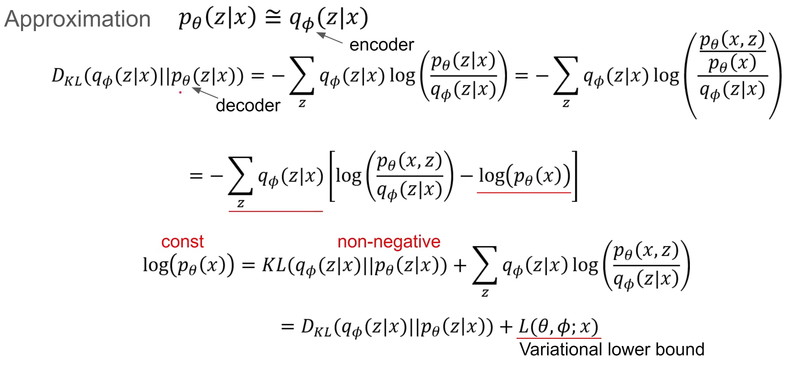

经过一系列变换，可以把lower bound转换为两项，Reconstruction Loss 和 Regularization Loss。 前一项在解码器还原得越接近输入时，可以变得更大。

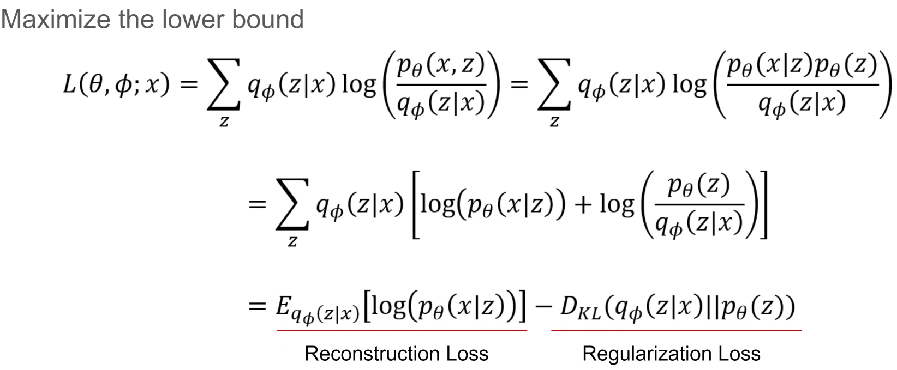

为了对 Reconstruction Loss 这一项求导，使用了 Generic Stochastic Gradient Variational Bayes (SGVB) estimator 进行估计后求导，求导时引入辅助随机变量作 Reparameterization来完成梯度传递。

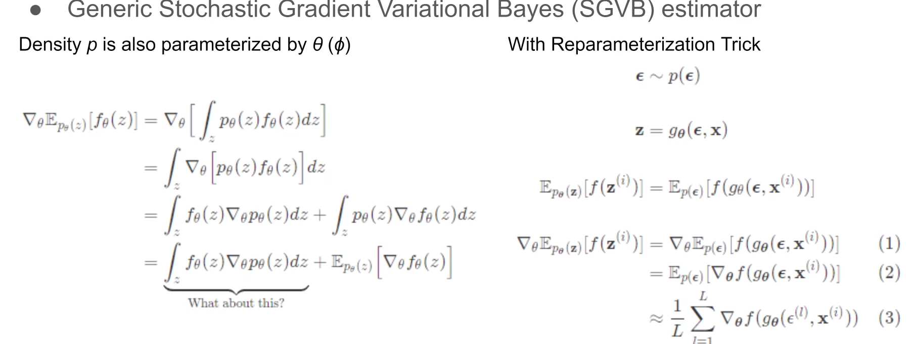

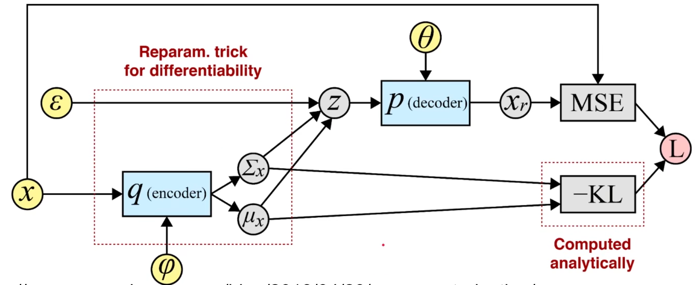

### 11.β-VAE Learning Basic Visual Concepts with a Constrained Variational Framework

论文地址:https://openreview.net/forum?id=Sy2fzU9gl

这篇是先将 LB 的求解转化约束条件下的最优化问题，最大化 Reconstruction Loss 项, 服从于 Regularization Loss < $\{epsilon}$ 。然后用 Lagrangian 方法来求解这种有条件的优化问题，在满足KKT条件的情况下，将不等式乘上一个 $\{beta}$ 系数，由于引入的 $\{epsilon} , \{beta}$ 所以变换时的一些常数项可以省略。最后化简出来就是 Regularization Loss 乘上了一个系数 $\{beta}$ ， $\{beta}$ 越大解出的 $Z$ 向量越解耦。 

实际操作的时候可用样本组合加分类的方式来检测出 $Z$ 向量与具体语义信息的相关性,是巧妙地设计下游任务的思路。

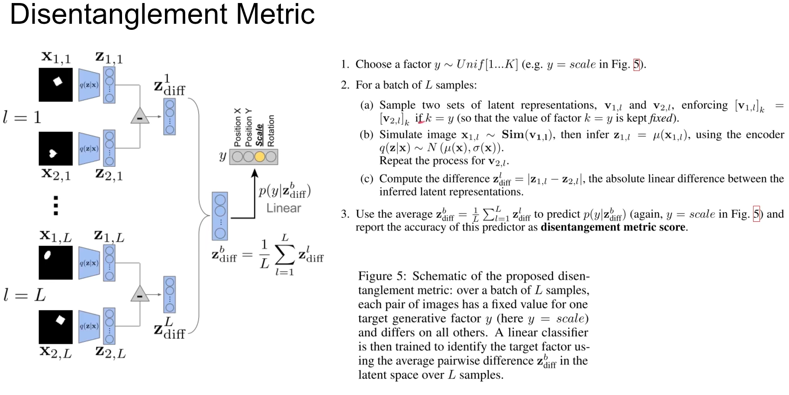

从结果而言，随着解耦的效果增强，重建的效果会减弱，但良好的解耦对下游任务可能更好，实际上也要做好平衡。

### 12.Neural discrete representation learning

论文地址:http://arxiv.org/abs/1711.00937

一个不错的代码实现: https://colab.research.google.com/github/zalandoresearch/pytorch-vq-vae/blob/master/vq-vae.ipynb

这篇就是VQ-VAE了，VAE具有Posterior Collapse的情况，decoder太强而不顾及latents的信息，解决的方法就是 Vector Quantisation，就是用类似聚类的方法搞一些prototype来代表概率密度，把编码器输出的隐向量的元素进行一些替换后再进行重建。替换的原则是选最小的L2距离，所以这个是个离散编码，所以生成的图像是有限的。传梯度是跳过了离散的 latents 层。

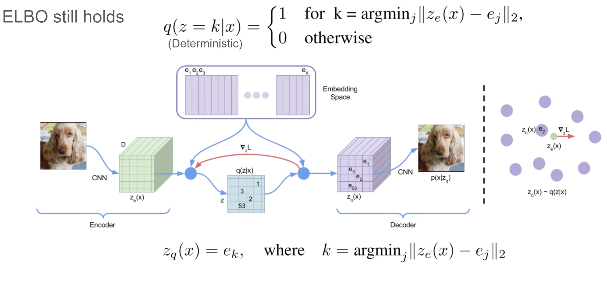

### 13. Contrastive Learning for Unpaired Image-to-Image Translation

论文地址:http://arxiv.org/abs/2007.15651

论文代码:https://github.com/taesungp/contrastive-unpaired-translation

这篇论文的核心思想是在用GAN做image translation的时候加入contrastive方法，来让图像质量得到增强，并且在transfer的过程中语义信息保持不变。在一般的GAN结构的基础上，本文加上了Multilayer, Patchwise Contrastive Loss，对于相同位置选出的patch应该保持相似的语义信息，其Contrastive loss应该保持相对的低，而不同位置的patch之间在transfer后应该远离，同一个样本的不同位置之间也应该相互远离。类似于SimCLR，把转移前后的两幅图像作为query和key分别输入到对比学习框架当中，这里的Encoder直接用了Generator的Encoder。

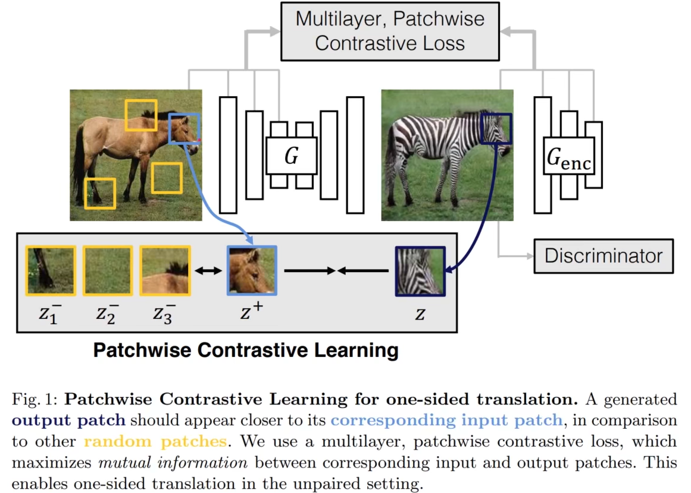

这里作者也做出了相应改进:1. Generator有很多层，在每一层都计算NCE可以得到更好的效果; 2. 在计算key的时候，类似于MOCO的设计，要将梯度停掉；3. Identity Loss: 类似CycleGAN，对于已经是目标域的图像，Generator 不应该再对其做出改变；4. External NCE Loss: 把其他图像也视为负样本。

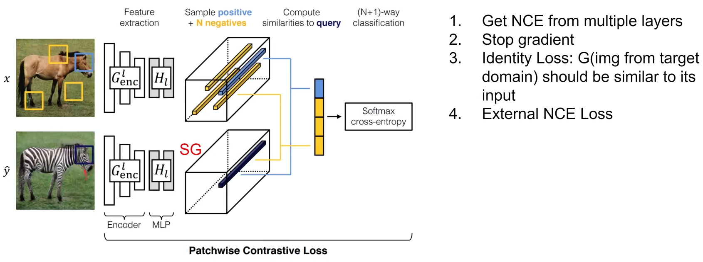

损失项还要加上GAN Loss(BCE)，构成总的损失函数；这里有两种构型，一种是CUT，是源域和目标域（Identity Loss）的图像都作为Generator的输入，另一种是去掉 Identity Loss。

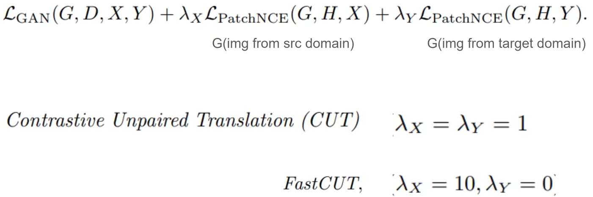

最后的结果是在下游任务上进行评估，下游图像是用生成的图像给训练的模型进行识别，准确率越高说明生成的图像越真实。FID 则是一种分布距离的度量方式，也被用来进行效果评估，值越小越好。随后是一些消融实验，分别是对不同的Generator的层计算NCE，或是同一幅还是不同的图像产生负样本，效果会如何进行了讨论。

### 14. Dual Contrastive Learning for Unsupervised Image-to-Image Translation

论文地址:http://arxiv.org/abs/2104.07689

论文代码:https://github.com/JunlinHan/DCLGAN

这篇论文是对上一篇13.论文的拓展，整了两个CUT，也就是两个Generator在源域和目标域之间互相转换，然后把两个Generator的Encoder拿出来过两层MLP后做 Info NCE Loss。这里除了GAN Loss，作者还搞了一个 SIM Loss (L1 Loss) 来辅助Discriminator对生成图像做判别，计算两个Latent feature的相似程度，避免model collapse。

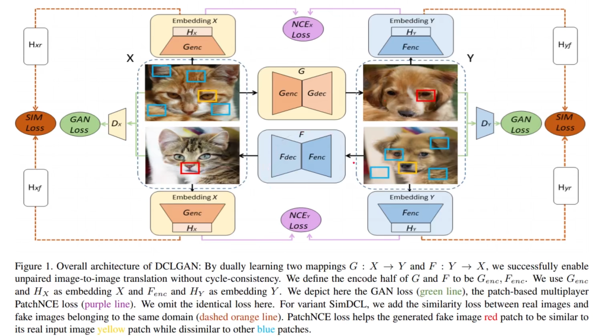

在消融实验中，作者搞了5种不同的配置：1) Not include RGB layer for NCE: 之前是每一层都算 NCE Loss, 这里去掉了第一层RGB，竟然发现性能得到很大提升；2) External negatives 这个效果有点反复； 3) Shared embeddings: 使用的两个Generator和MLP是否一样，一样会损失性能；4) Cycle-consistency loss: 加上对性能没有显著提升; 5) Remove the dual setting。

### 15. Representation Learning with Contrastive Predictive Coding

论文地址:http://arxiv.org/abs/1807.03748

这篇论文本质上是通过预测未来的任务，加上对比学习的手段来得到一个好的表示。在以往的很多任务中，predict the future一直是一种很好的得到一个好的特征表示的一个手段。
predict the future -> good representation -> mutual information (互信息)

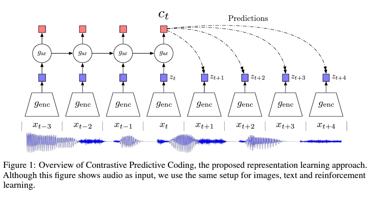

原始信号 $x_t$ 经过一个enconder之后得到latent reprentation $z_t$ ,然后再将 $z_t$ 接一个 auto-regressive model，得到另一个特征 $c_t$ ，然后用 $c_t$ 来对后续的 latent reprentation $z_{t+1}$ 等进行预测(直接预测 $x_t+1$ 等相对困难，而且不能有效利用互信息)。

$z_t = g_{enc}(x_t)$ (CNN),  $c_t = g_{ar}(z{{\leq}})$
