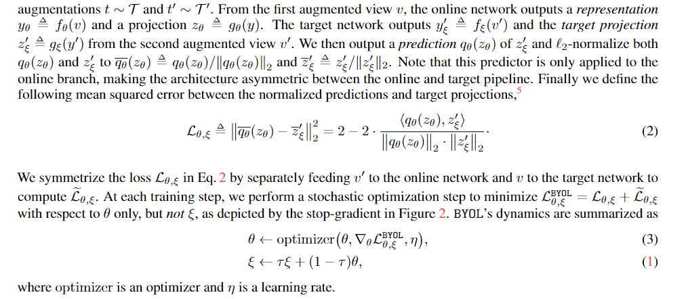

### 1. Bootstrap your own latent: A new approach to self-supervised Learning

论文地址:https://arxiv.org/abs/2006.07733

代码:https://github.com/deepmind/deepmind-research/tree/master/byol

这篇论文的观察是说现在的网络越来越大，越来越深，那就需要更多的数据来进行训练，而且还可能有梯度消失，梯度爆炸的情况。~呃，那能不能不做这么多题就得到较好的结果呢？~ 现在版本是利用自监督学习或无监督的方法利用更少的数据学到更好的特征表示。

这篇文章的模型结构如图所示，会同时维持两个相同的网络，分为online和target，训练的过程中使online网络不断逼近target网络，target网络也使用 momentum 方式缓慢地更新自己的参数向 online靠拢。~左脚踩右脚~ 具体的流程是，对于同一幅图像，采用两种不同的随机增强策略，分别送入online和target网络，得到两个不同的表示，再通过projection得到新的投影特征（更高维）。对于online网络，会多接一个 $q_{\theta}$ 网络对target分支进行靠拢；而对于target分支，有一个sg(stop gradient)的标志，停止梯度的传播。图中的Loss(MSE)只是作用于online分支的训练，target分支以动量的方式缓慢向online分支靠拢，但两个分支的参数不会达到相同。

从下面的图中可以看到Loss的更新过程，其中 $L^{BYOL}$ 需要将两个分支的view输入交换得到。

最终得到的是 $f_{\theta}$ 编码器。本质而言，因为有不同策略的图像增强方法，然后通过差异化比较提取出更有效的特征，和对比学习异曲同工。最后作者对比了和Supervised方法和SimCLR方法在ImageNet上的结果，以及一系列消融实验，这里和对比学习的区别在于，由于没有使用负样本，所以对batch size的大小并不敏感（~实际上还是不可避免地敏感~），算是优势之一。

### 2. Exploring Simple Siamese Representation Learning

论文地址:https://arxiv.org/abs/2011.10566

非官方实现:https://github.com/PatrickHua/SimSiam

Siamese 网络比起 BYOL 没有使用动量方法，并且网络结构相对简单，也是一开始分成了两个支，并且使用了相同的权重，但是输入是两个不同的向量，是由同一个输入图像x增强产生的两个不同的图像后输入两个编码器中。其中一个分支进行projection后计算两个分支输出的MSE Loss。

所以为什么如此简单的结构依然能够work呢？分别从以下几个方面进行了测试：1)是否有stop-grad; 2)用不同的predictor; 3)batch-size 和 batch-norm; 4) Similarity Function。
作者猜想的原因是SimSiam是一种最大期望(Expectation-Maximization, EM)算法的实现(~其实我并没有看懂哈哈~)。
然后是进行了相关的消融实验，基于ResNet-50 pre-trained encoder做的，性能表现比起以往工作没有明显下降甚至提升。

### 3. Evolving Losses for Unsupervised Video Representation Learning

论文地址:https://arxiv.org/abs/2002.12177

这篇论文把 unsupervised representation learning 定义成了一个 multi-modal, multi-task learning ，希望结合不同的无监督方法来综合学到一个好的video表示(简介部分)。
multi modality是指提取出各种不同的数据模态（彩色图像、灰度图像、声音以及光流等），multi task是指使用了多种SSL手段，然鹅把各种模态和任务集成到一起(~格调好高，big胆~)，对于损失函数的构建将是一场灾难，要包括的超参数的数量太多了。所以这篇论文的贡献就是怎么去找一个好的损失函数了。

看下图就是不同模态和任务的组合，这个过程中就是把光流和声音网络蒸馏到RGB网络中，只用RGB图像就可以解出一个包含光流和声音信息的representation，以更好的支持后续的下游任务。
关于SS任务，本文搞了以下几个：
1) Reconstruction and prediction: Reconstruct input frame; predict the next N frames given T frames; Cross-modality transfer tasks.
2) Temporal ordering: 判断正反向播放和是否乱序播放（CE loss）（~描述太长概括了~）
3) Multi-modal contrastive loss: 在视频同一个时刻的不同模态所得到的latent representation应该尽量接近，而对于同一个视频不同时刻或是不同视频的模态得到的隐表示应该相互远离。
4) Multi-modal alignment: 不同模态做正负样本，判断是否对齐。

总之就这样搞了一个大的损失函数，那么怎么评价呢？作者发现dataset中样本的数量和标签满足 Zipf 分布（一个标签所对应样本的数量和这个样本的值呈反比关系，类似二八定律）。所以评价方法是对隐表示进行聚类后，对每个类别的样本数量的也应该接近Zipf分布（KL散度判断）。
优化损失函数参数的方法则是搞了一些最优化的搜索方法，像是随机搜索，Grid搜索，最后发现最好的方法是CMA-ES(~没听说过，不懂~)。

最后在不同数据集上进行评测，做了一系列消融实验，对比了有监督学习的方法的表现，效果自然挺好。

### 4. Barlow Twins: Self-Supervised Learning via Redundancy Reduction

论文地址:https://arxiv.org/abs/2103.03230

论文代码:https://github.com/facebookresearch/barlowtwins

这篇文章也是研究一种SSL学到一种更好的表示，同之前的方法相比，本文也是使用了两分支网络，但是梯度的传递和损失函数的构建是与前文不同的。从结构上看，同样是将图像进行不同形式的增强后，输入到两个参数一致网络当中，得到隐向量 $Z^A$ 和 $Z^B$ 。然后计算 $Z^A$ 和 $Z^B$ 对应位置元素的相关性，其相关矩阵尽量接近对角阵。

从结果来看，也是对比了之前的方法，然后是在ImageNet上的相关任务的表现，图像分类和迁移学习啥的。（~小技巧：如果你的实验结果表现一般，可以把Top 3都用下划线标出来，这样读者就难以一眼丁真，发现你的方法没有别人的好捏~）而从消融实验来看，本文方法的结果对隐向量 $Z$ 的长度敏感。

### 5. Unsupervised Learning of Visual Features by Contrasting Cluster Assignments

论文地址:http://arxiv.org/abs/2006.09882

代码:https://github.com/facebookresearch/swav

这篇论文的主要贡献是提出了一种在线算法，用来做SSL，不需要在完整的大数据集上做训练，可以不断加入新的数据改善效果。此外，本文还提出了一种新的图像增强策略叫做 multi-crop，截取图像中的一小块作为增强的样本，在节省内存的情况提高样本多样性。对比学习需要进行特征对比从而带来两个问题：1) 需要做大量样本进行相互对比，所以batch size需要大，才能够更好地把不同样本区别开；2) 随着样本数量的增加，计算量也呈指数倍地增加。那么可以用聚类的方法来达到提升效率和效果的目的，本文提出了Swap的方法，交换从feature到聚类和从聚类到feature的投影方向，才能避免所有的模型都collapse到聚类空间的某一个点上。

从结构上可以看出，与之前的对比学习方法相比，本文引入了一个Prototypes，是一系列聚类中心的集合。这里 $Q$ 是通过 Prototypes 和 $Z$ 共同计算（相乘）得出，相比于 $Z$ 的维度是比较低的，因此可以减少运算量（类似降维）。

所用到的损失为 Cross-entropy, 写出来就是下面的形式（~看不懂啊，咋想到的~）:

$Q$ 的实现被作者定义为

