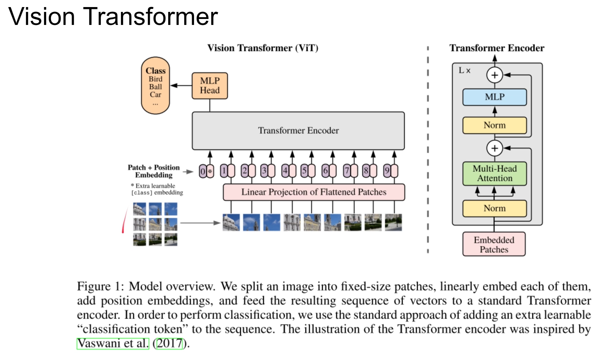
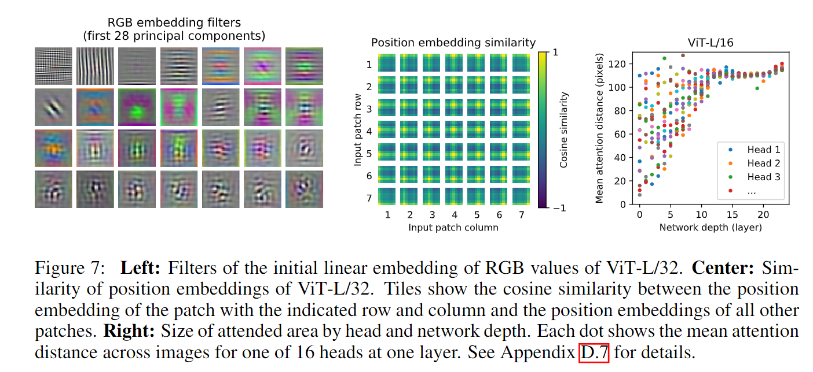
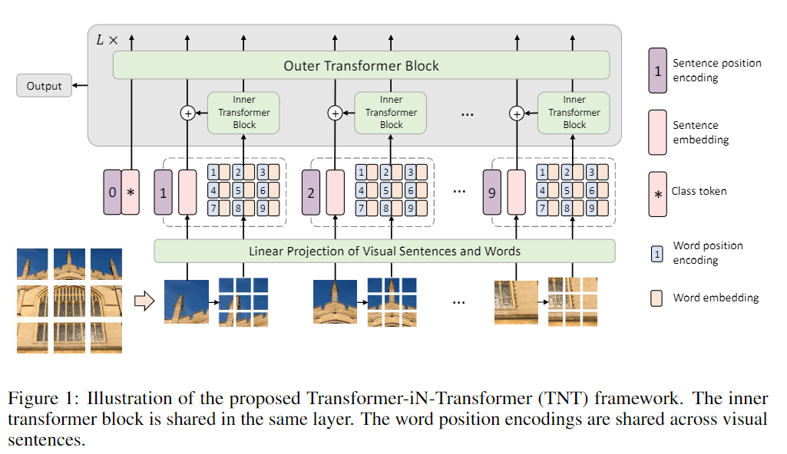
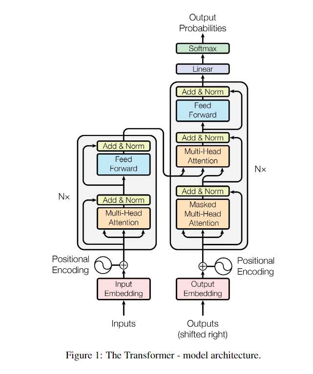
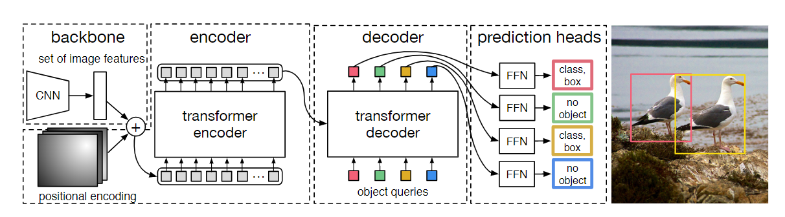

### 1. Exploring Self-attention for Image Recognition

论文链接：https://arxiv.org/abs/2004.13621

代码地址:https://github.com/hszhao/SAN

Self-attention机制所驱动的核心思想，为什么能work的解释?在图像处理中是临近相关是很重要的，因此会有卷积网络的提出和应用，但是全局之间的相互关系也是有意义的。模型的复杂度或者说一般性都是好提升的，全连接每个像素也不是不行，难的还是在这种自由度和先验之间找到一个好的平衡点。Self-attention比起卷积网络还是更加灵活泛化，从网络结构来看能够更快的聚合全局信息。但是完全的灵活泛化在实际的工作中也并非那么可靠，例如为什么不直接使用一个全连接的网络呢？Self-attention机制与卷积网络相似，也是对于MLP这样绝对灵活的网络添加了一些约

总的结构就是这个样子了，Pairwise Self-attention 和 Patchwise Self-attention不同在于作Self-Attention的元素分别为像素和块。核心思想是一样的，分出两个分支再集合起来，最后连上残差。因为有残差，所以可以想象是能够堆叠的，一些经典方法的残差部分也被替换为了Self-attention机制。

结果如图，那自然是文中提出的结构效果更好，尤其是patchwise方法。当然作者在消融实验中还讨论了一些结构设计上的变量（比如全连接层加多少层，是否塞激活函数），以及position encoding带来的影响。此外作者还进行了其他的鲁棒性测试，但基本上是对于卷积网络的对抗性测试（旋转90°），所以本文所提出的方法自然更好。

### 2. An Image is Worth 16x16 Words: Transformers for Image Recognition at Scale

论文地址:https://arxiv.org/abs/2010.11929

代码地址:https://github.com/google-research/vision_transformer

ViT 这篇论文算是Transformer 图像处理的始祖论文了，先是介绍了一番Transformer在NLP上的应用，然后是关于卷积网络的成功和局限。ViT所做得就是如图的操作，输入包含位置编码的10个token，输出10个token，最后选一个token接下游任务。其实整个过程要细致理解还是得结合Transformer Encoder的流程图来看，怎么编码和过结构的。

性能如何呢？作者的消融实验从模型结构的层数、参数量和图像patch拆分大小进行了讨论。给出了不同数据集下的结果。然后是一些可视化的结果，比如RGB embedding filters、Position embedding similarity 和Mean attention distance(pixels)。可以看出给出的patch间的位置关系以及对于浅网络结构所捕捉的图像间的长距离相关关系。

### 3. Transformer in Transformer

论文地址:https://arxiv.org/abs/2103.00112

非官方实现:https://github.com/lucidrains/transformer-in-transformer

总体结构如图所示，将之前的ViT的Transform Encoder替换为文中提出的TNT(Transformer iN Transformer) Blocks，维护两个Transformer，分别称为Outer T-Block 和 Inner T-Block，从图中可以看出分别处理Patch level embedding 和 Pixel level embeddings。区别于论文 1.，这里的Pixel不一定是像素，可以把大的Patch拆分为小的Patches，就可以提出一个token。关于两个T-Block之间的信息交互，如图所示，将Pixel embeddings过Inner T-Block后拼接起来，然后过一个Linear Layer再与Patch Embedding 加和后传入Outer T-Block，完成从粗到细的金字塔结构的特征提取。

性能上也是outperform之前的方法，做了一系列消融实验，包括迁移实验等的Fine-tunning。

### 4. End-to-End Object Detection with Transfromers

论文地址:https://arxiv.org/abs/2005.12872

代码地址:https://github.com/facebookresearch/detr

这一篇是把Transformer的结构用到了目标检测上，是编码器-解码器的结构，避免了NMS, 生成锚点等繁琐的操作。Transformer的解码器首先是带mask的attention，mask的原因是模仿RNN这样的时序结构，只对前向的token做attention，注重时空因果上的关系。然后之所以有两个Multi-Head Attention，是因为第二个Multi-Head Attention需要和编码器的信息进行交互。

                                                                 
DETR 通过token的query list的方式来生成Object Proposal来确定物体的种类和 Bounding Box。其实和 Proposal Region差不多，也是整了很多额外的no object token来对应无物体的情况。损失函数分为Classification Loss (经典CrossEntropy Loss，无物体时不参与计算) 和 Bounding Box Loss (L1 Loss)。由于预测和标签存在顺序不一致的情况，作者使用了匈牙利算法进行了最优匹配。shengwei

本文网络结构就是 CNN 接Transformer的结构，如图所示，CNN 就是提取特征得到Token的作用，有点像PointNet先升维后降维的操作（CNN升维，1x1 conv 降维）。Positional Embedding只给key和query加了，value没有加。解码器这边的输入就是N个token，N就代表proposal的数量了，一开始全部都是0向量（但是要加 Positional Embedding）,输出就结合损失函数看，进行分支即可。当中有一些辅助Loss就是每一层都算一次损失，进行预测的FFNs共享一套权重。
 

本文的优势在于避免了繁琐的后处理，然后结果展示了消融实验的结果和进行了相应的可视化。

### 5. Training data-efficient image transformers & distillation through attention

论文地址:https://arxiv.org/pdf/2012.12877.pdf

论文代码:https://github.com/facebookresearch/deit

本文相比于ViT，本文关注于data efficient，用更少的数据和参数达到较好的效果。ViT的问题在于不好训练，并从1.可以看出比较泛化，缺乏像CNN一样的归纳偏置。本文做知识蒸馏，分为Soft distillation 和 Hard-label distillation。Soft的损失分为Cross Entropy (CE)的图像分类项以及student 和 teacher 模型的 KL Loss项（两个模型输出的分布尽量接近）。Hard-label的损失直接将 teacher 模型的输出作为 ground-truth 构建两项 CE 损失。

另一方面，与ViT相比，编码器除了加class token，还加了一个distillation token用来接收teacher 模型产生的label。最后作者进行了消融实验研究性能的提升，主要是说明蒸馏过程是有效的。
