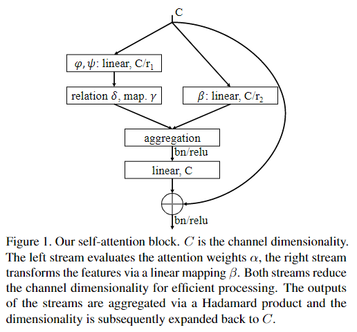
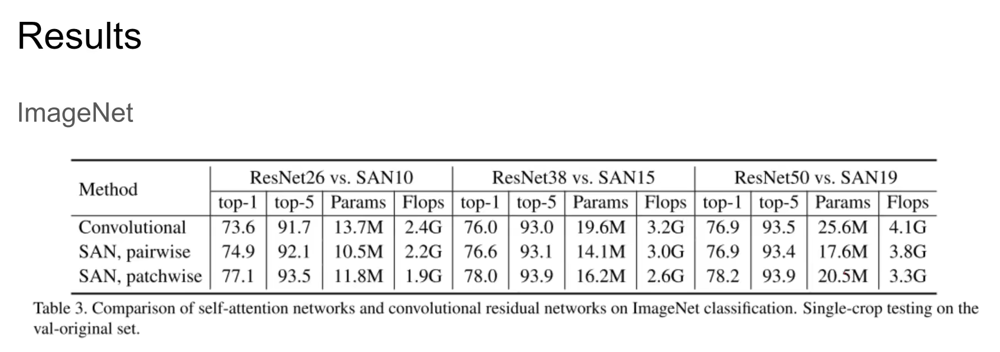

#### Exploring Self-attention for Image Recognition

论文链接：https://arxiv.org/abs/2004.13621

代码地址:https://github.com/hszhao/SAN

#### Self-attention机制所驱动的核心思想，为什么能work的解释?

在图像处理中是临近相关是很重要的，因此会有卷积网络的提出和应用，但是全局之间的相互关系也是有意义的。模型的复杂度或者说一般性都是好提升的，全连接每个像素也不是不行，难的还是在这种自由度和先验之间找到一个好的平衡点。Self-attention比起卷积网络还是更加灵活泛化，从网络结构来看能够更快的聚合全局信息。但是完全的灵活泛化在实际的工作中也并非那么可靠，例如为什么不直接使用一个全连接的网络呢？Self-attention机制与卷积网络相似，也是对于MLP这样绝对灵活的网络添加了一些约束。

#### Pairwise Self-attention 和 Patchwise Self-attention ?

总的结构就是这个样子了，Pairwise Self-attention 和 Patchwise Self-attention不同在于作Self-Attention的元素分别为像素和块。核心思想是一样的，分出两个分支再集合起来，最后连上残差。因为有残差，所以可以想象是能够堆叠的，一些经典方法的残差部分也被替换为了Self-attention机制。

结果如图，那自然是文中提出的结构效果更好，尤其是patchwise方法。当然作者在消融实验中还讨论了一些结构设计上的变量（比如全连接层加多少层，是否塞激活函数），以及position encoding带来的影响。此外作者还进行了其他的鲁棒性测试，但基本上是对于卷积网络的对抗性测试（旋转90°），所以本文所提出的方法自然更好。
