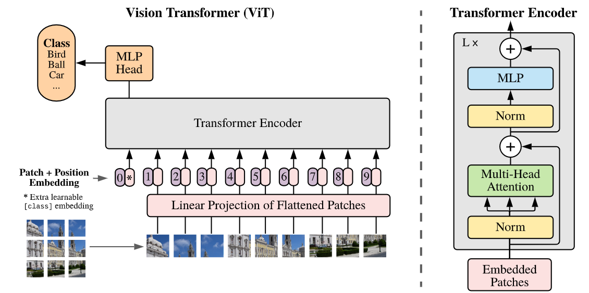

### Exploring Self-attention for Image Recognition

论文链接：https://arxiv.org/abs/2004.13621

代码地址:https://github.com/hszhao/SAN

#### Self-attention机制所驱动的核心思想，为什么能work的解释?

在图像处理中是临近相关是很重要的，因此会有卷积网络的提出和应用，但是全局之间的相互关系也是有意义的。模型的复杂度或者说一般性都是好提升的，全连接每个像素也不是不行，难的还是在这种自由度和先验之间找到一个好的平衡点。Self-attention比起卷积网络还是更加灵活泛化，从网络结构来看能够更快的聚合全局信息。但是完全的灵活泛化在实际的工作中也并非那么可靠，例如为什么不直接使用一个全连接的网络呢？Self-attention机制与卷积网络相似，也是对于MLP这样绝对灵活的网络添加了一些约束。

#### Pairwise Self-attention 和 Patchwise Self-attention ?

总的结构就是这个样子了，Pairwise Self-attention 和 Patchwise Self-attention不同在于作Self-Attention的元素分别为像素和块。核心思想是一样的，分出两个分支再集合起来，最后连上残差。因为有残差，所以可以想象是能够堆叠的，一些经典方法的残差部分也被替换为了Self-attention机制。

结果如图，那自然是文中提出的结构效果更好，尤其是patchwise方法。当然作者在消融实验中还讨论了一些结构设计上的变量（比如全连接层加多少层，是否塞激活函数），以及position encoding带来的影响。此外作者还进行了其他的鲁棒性测试，但基本上是对于卷积网络的对抗性测试（旋转90°），所以本文所提出的方法自然更好。

### An Image is Worth 16x16 Words: Transformers for Image Recognition at Scale

论文地址:https://arxiv.org/abs/2010.11929

代码地址:https://github.com/google-research/vision_transformer

ViT 这篇论文算是Transformer 图像处理的始祖论文了，先是介绍了一番Transformer在NLP上的应用，然后是关于卷积网络的成功和局限。ViT所做得就是如图的操作，输入包含位置编码的10个token，输出10个token，最后选一个token接下游任务。其实整个过程要细致理解还是得结合Transformer Encoder的流程图来看，怎么编码和过结构的。

性能如何呢？作者的消融实验从模型结构的层数、参数量和图像patch拆分大小进行了讨论。给出了不同数据集下的结果。然后是一些可视化的结果，比如RGB embedding filters、Position embedding similarity 和Mean attention distance(pixels)。可以看出给出的patch间的位置关系以及对于浅网络结构所捕捉的图像间的长距离相关关系。

