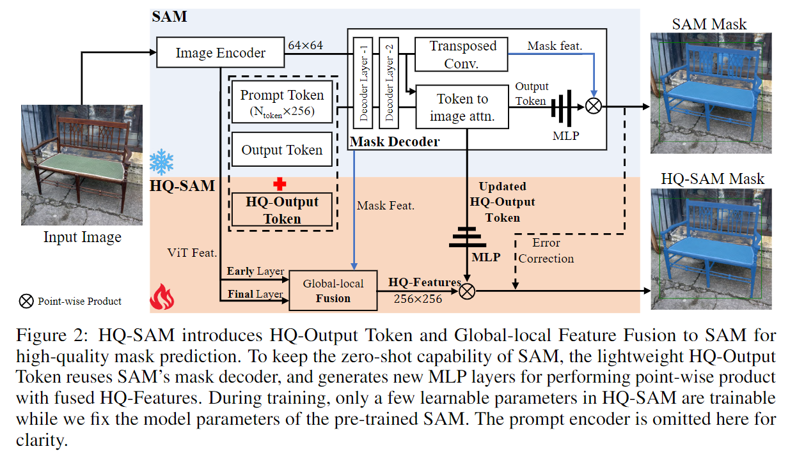

### 2023年6月26日

#### 1. A Comprehensive Survey on Segment Anything Model for Vision and Beyond

SAM 综述，讲得挺杂的

#### 2. Segment Anything in High Quality

SAM存在两个关键问题：1）粗糙的掩码边界，通常甚至忽略了细微物体结构的分割；2）在挑战性情况下出现错误预测、破碎的掩码或大误差。这通常涉及SAM误解细微结构。HQ-SAM提出了SAM的最小适应方案，仅增加了不到0.5%的参数，扩展其高质量分割的能力。

HQ-SAM模型能够在零样本的情况下产生更高质量的分割结果，同时保持与SAM模型相同的零样本分割性能。为了实现更高质量的分割结果，作者提出了一个可学习的HQ-Output Token，用于输入到SAM的掩模解码器，同时使用全局语义上下文和细粒度的本地特征来操作一组经过完善的特征以实现更准确的分割结果。作者还构建了一个新的数据集HQSeg-44K，包含44K张图像及其注释掩模，用于高精度分割的训练。最后，在各种下游任务中进行了广泛的定量和定性实验分析，证明了HQ-SAM模型的有效性。

